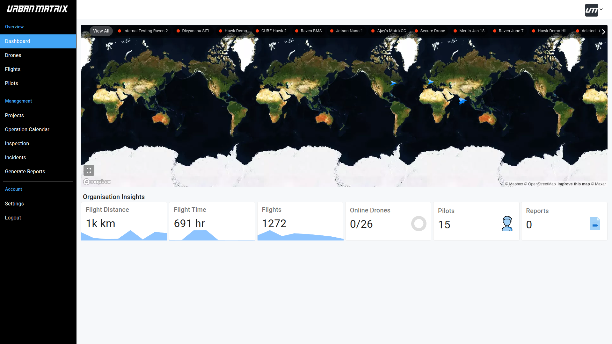
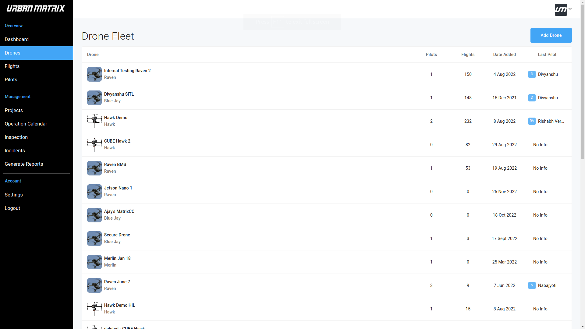
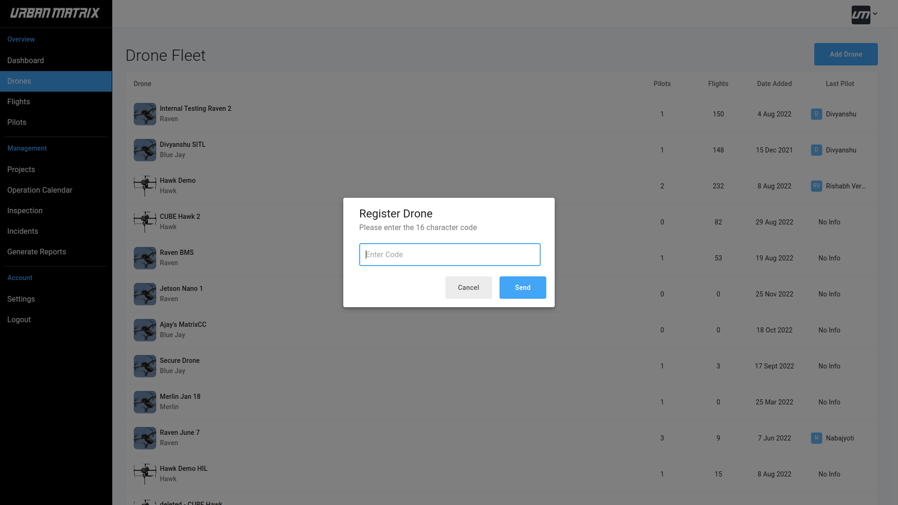
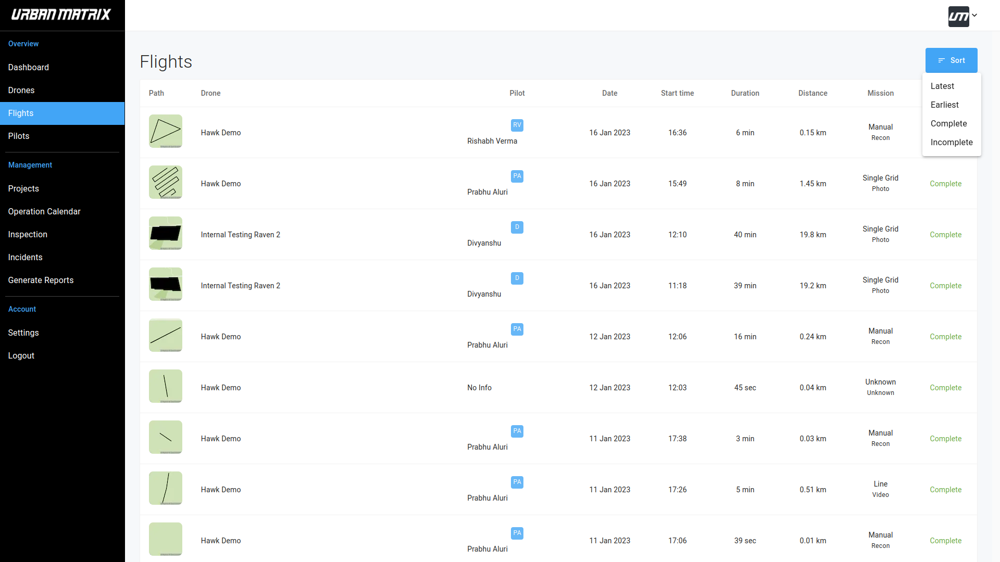
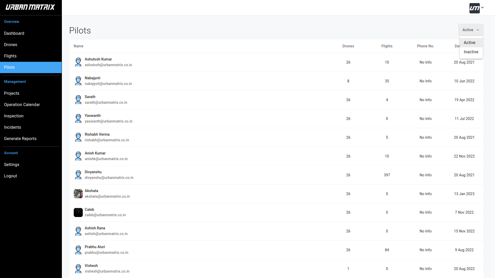

# Dashboard 

## Organisation Insights

- Flight Distance : Summation of the total distance covered by all your drones. 
- Flight Time : Summation of the total flight time of all your drones. 
- Flights : Total number of flights. 
- Online Drones : Number of drones online by total number of registered drones. 
- Pilots : Total number of ACTIVE pilots. 
- Reports : Total number of reports generated. 

# Drones

## Drone Fleet

- This page gives a tabular visualisation of all your drones. 
- Clicking on a specifc drone shows its Flight Log History. This is explained in details [here](/Matrix%20Console/Features/4.%20Flight%20Log%20History.md)

## Register Drone

- You register a new drone by clicking on "Add Drone".
- Enter the 16 character code.
- Click on "Send"

# Flights

# Pilots

