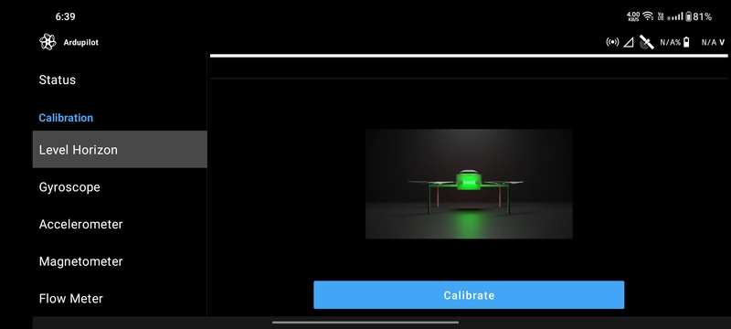
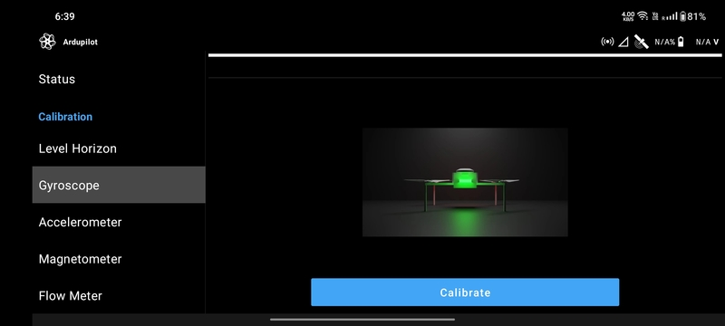
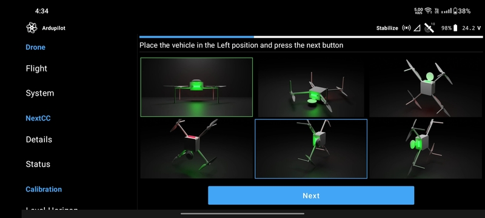
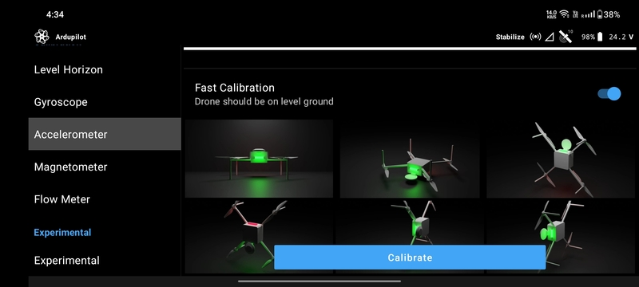
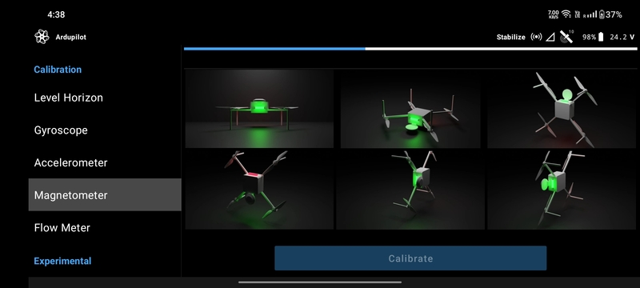
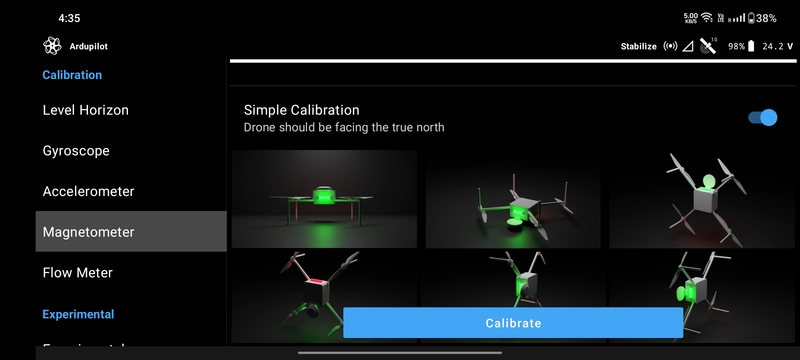
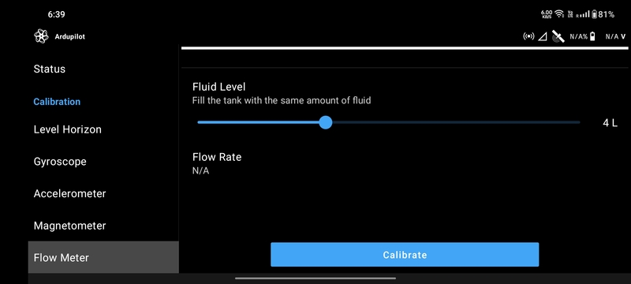

# Calibration

## Level Horizon

1. Place the drone in the level flight position on a level surface.
2. Click the `Calibrate` button.
3. Let the calibration complete on its own. It will take a few seconds for it to complete.
4. Restart the drone.

## Gyroscope

1. Place the drone on a stable flat surface.
2. Click the `Calibrate` button.
3. Let the calibration complete on its own. It will take a few seconds for it to complete.
4. Restart the drone.

## Accelerometer

### PX4

1. Click the `Calibrate` button.
2. Hold the drone still in one of the positions shown on the screen. The outline of the detected position will turn
   blue.
3. Once the calibration for the position is complete, the outline will turn green.
4. Repeat the process for the remaining positions.
5. Restart the drone.

### Ardupilot - Normal

1. Click the `Calibrate` button.
2. LaunchPad will indicate the position that the drone is required to be placed at by turning the outline of the
   position blue.
3. Place the drone in the position and click the `Next` button.
4. Repeat the process fot the remaining positions.
5. Restart the drone.

### Ardupilot - Fast

## Magnetometer

### PX4

1. Click the `Calibrate` button.
2. Lift the drone and hold the drone still in one of the positions shown on the screen. The outline of the detected
   position will turn blue.
3. Rotate the drone around the axis in one or both directions.
4. Once the calibration for the position is complete, the outline will turn green.
5. Repeat the process for the remaining positions.
6. Restart the drone.

### Ardupilot - Normal

1. Click the `Calibrate` button.
2. Lift the drone and rotate it with full 360-degree turns so that each side points down for a few seconds.
3. Continue the process till the blue progress bar on the screen fills up completely.
4. Restart the drone.

### Ardupilot - Simple

## Flow Meter

Flow meter calibration works only on the drones that have a NextCC installed. Refer the
[NextCC Agriculture Setup](/next-cc/agriculture.md) for details on the same.

1. Fill the drone's tank with water between 1 to 10 litres. Please make sure the water is measured accurately.
2. Move the slider in the flow meter calibration screen to input the same amount of liquid.
3. Click the `Calibrate` button.
4. The drone will start the pump automatically. Wait for the tank to get empty. The drone to stop the pump once it is
   done.
5. Restart the drone.

