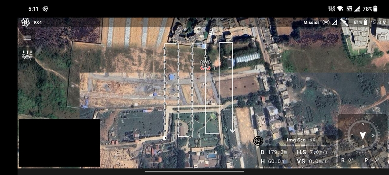
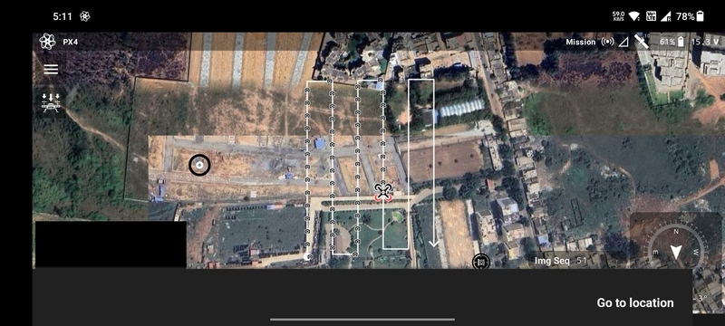
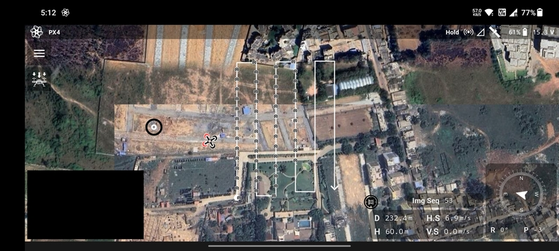
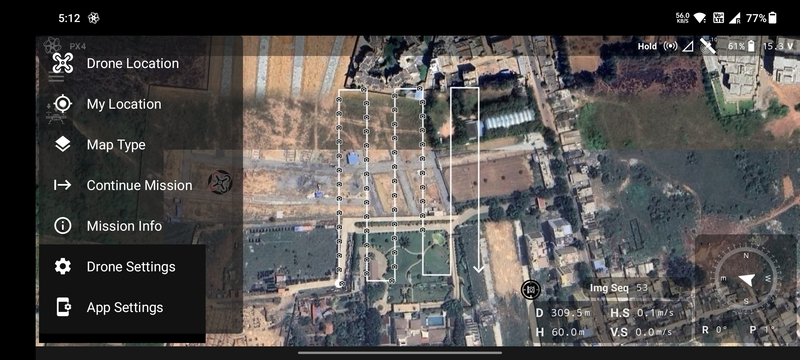

# In-Flight

## Mission Mode

Based on the type of mission, the drone will perform the automated actions accordingly.

### Survey

For a survey mission the drone will follow the planned path and take pictures at the pre-defined locations based on the
parameters set while planning the mission.

### Agriculture

For an agriculture mission the drone will fly over the planned grid lines. It will start spraying at the start of the
line and stop spraying at the end.

## Go To Location

Users have the option to make the drone go to any location while the drone is in-air. Long-click at any point on the
map. A target will appear at that location and you will be prompted a button to execute the `Go to location` command.

If the `Go to location` button is clicked, the drone will pause the mission and start moving towards the target
maintaining its altitude.

## Continue Mission

If the mission pauses due to the pilot taking manual control or `Go to location` being triggered, then the mission can
be resumed by clicking the `Continue Mission` option in the [Flight Screen](/launchpad/overview/flight-screen.md) menu.
The flight mode will change back to mission mode and the drone will resume the mission from where it paused.

