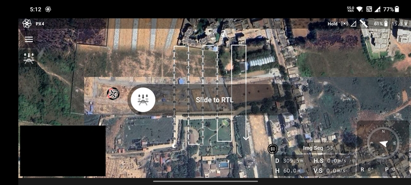
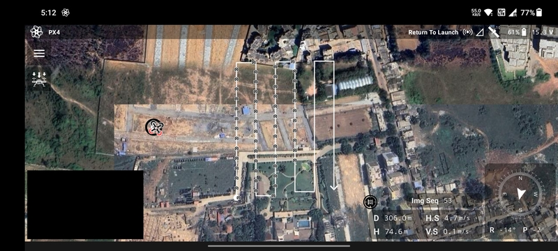
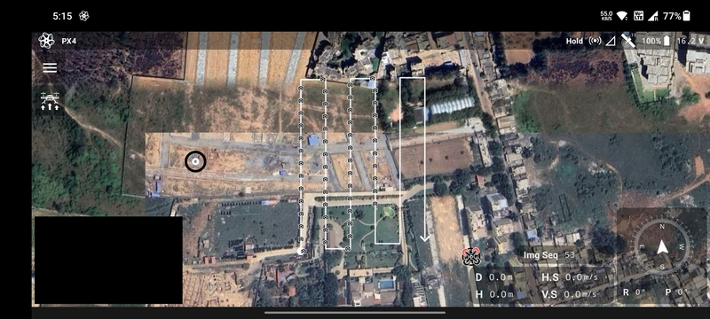

# Return to Launch and Landing

Return to launch or `RTL` is used to make the drone fly safely back to the home/launch location and land it.

When the drone is armed, the `Upload Mission` button becomes the `RTL` button. To make the drone perform an `RTL`, click
the button. A slider will be shown to confirm the action.

Once the user swipes the slider to the right the drone will execute the `RTL` action.

The drone will first climb till it reaches the `RTL Altitude` set by the user during
[Mission Planning](/launchpad/mission-planning).

After that, it will fly in a straight line towards the home location maintaining the `RTL Altitude`.

Upon reaching the home location it will land safely.

