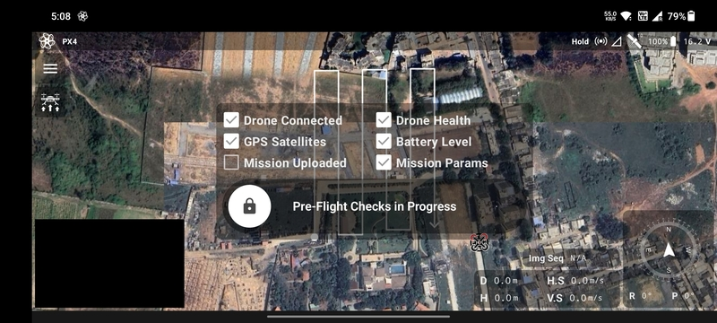

# Upload Mission and Takeoff

After the mission planning is done, the user moves on to the flight screen. Refer the
[Flight Screen](/launchpad/overview/flight-screen.md) section to get an overview of the elements of this screen.

## Upload

Click the `Upload Button` to start the mission upload process. The pre-flight checks will be conducted while the mission
gets uploaded.

## Takeoff

Once the mission is uploaded and the pre-flight checks have completed successfully, the slider will get unlocked.

Swipe it to the right to make the drone arm its motors and takeoff. The drone will now start the automated mission.

