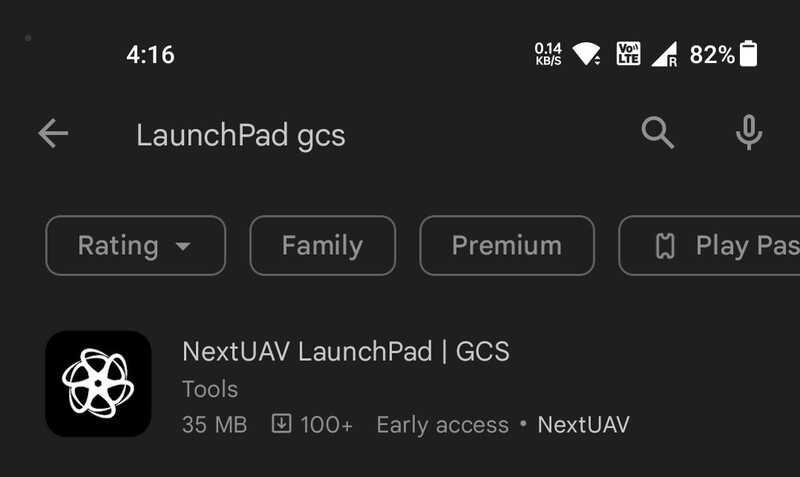
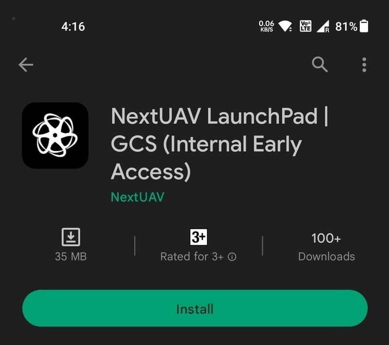

# Install

## Finding the Application

LaunchPad is currently available **only for Android** devices. It can be found on the Google
[Play Store](https://play.google.com/store/apps/details?id=com.urbanmatrix.android.launchpad).

Else, you can open the Google Play Store and type **launchpad gcs** in the search bar. **NextUAV LaunchPad | GCS**
should come up in the results.

## Installing the Application

Click on the `Install` button.
