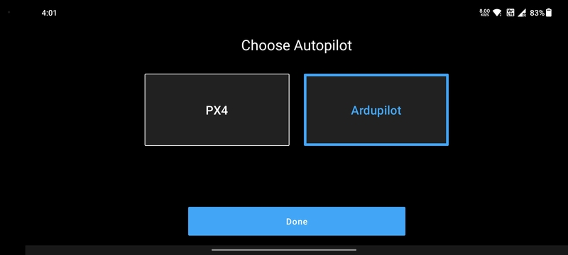

# Select Autopilot

LaunchPad supports `PX4` and `Ardupilot` based drones. When the app is started for the first time, the users get to
select between the two systems. Select the autopilot system of your drone and click the `Done` button.

This can be changed later in the [App Settings](../settings/app-settings.md).

