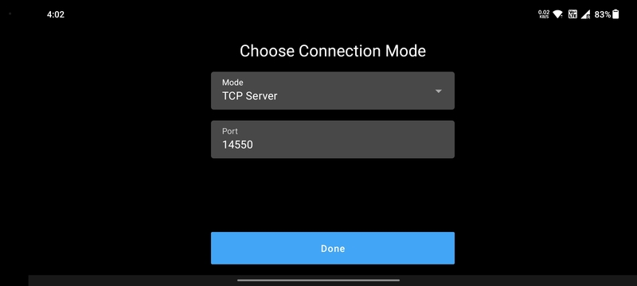
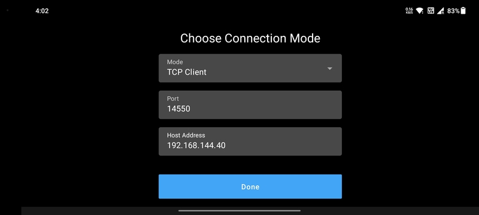
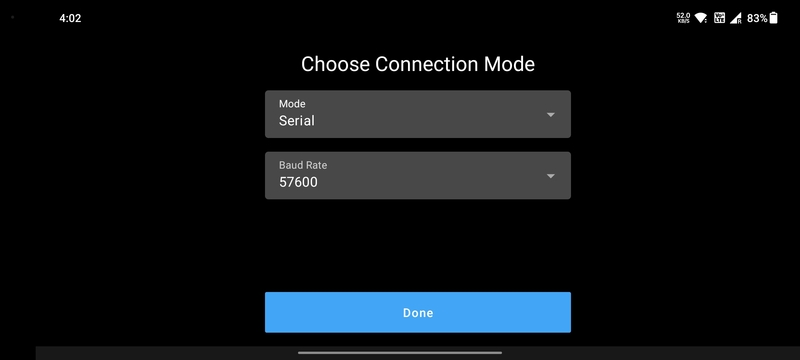
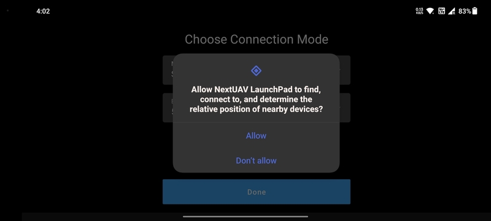
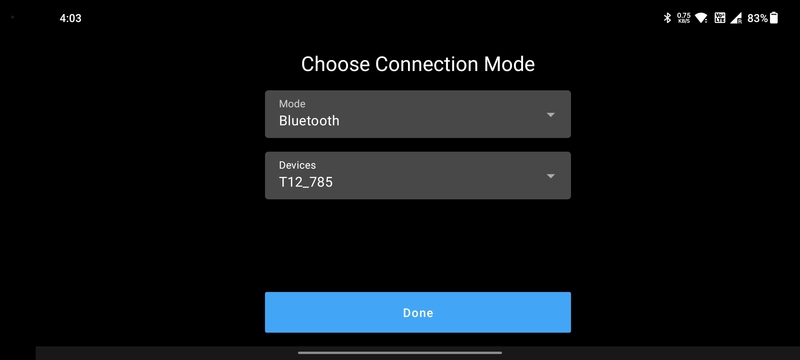

# Setup Connection

LaunchPad provides a number of ways to create the telemetry connection. Setup the connection mode according to your
telemetry device's specification and click the `Done` button to continue.

## UDP Server

The app acts as a UDP server. The user needs to input the `UDP Port` provided by the telemetry device.

This mode is useful when the telemetry transmitter is a *Herelink*. When the user's phone is connected to the
*Herelink's* hotspot, the telemetry data is available at the port number **14550**.

## TCP Server

The app acts as a TCP server. The user needs to input the `TCP Port` provided by the telemetry device.

## TCP Client

The app acts as a TCP client. The user needs to input the `TCP Port and Address` provided by the telemetry device.

## Serial

Serial connection is for data transfer through a wired connection. Connect the serial telemetry device to the phone's
USB port and enable the **USB OTG** mode in the phone's settings.

Set the correct `Baud Rate` provided by the serial device.

For *SIYI MK15*, this mode is used for data transfer when the *MK15's* link is configured to be in the **USB COM** mode.

## Bluetooth

The phone's Bluetooth modem can be used for creating the telemetry connection. For this mode, make sure that the
phone's Bluetooth is turned on and that the telemetry device is already paired with the phone. Refer
[Connect through Bluetooth on your Android device](https://support.google.com/android/answer/9075925?hl=en) for 
instructions on how to pair the telemetry device with your phone.

Click the `Mode` dropdown menu and select the `Bluetooth` option. Provide the Bluetooth permissions to allow LaunchPad
to use the modem.

Select the telemetry device from the list of available devices to setup the connection.

This mode can be used with any *SkyDroid* device.
