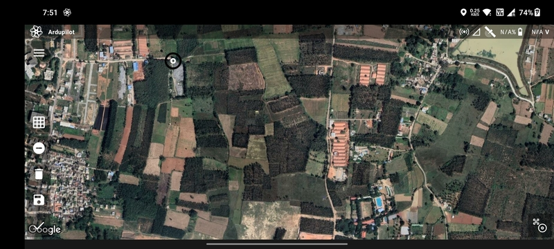
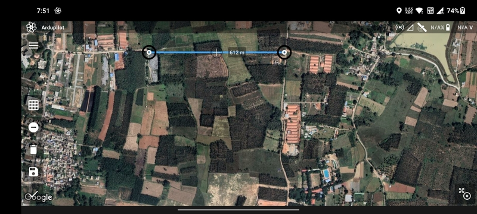
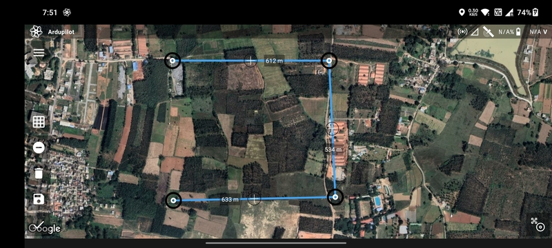
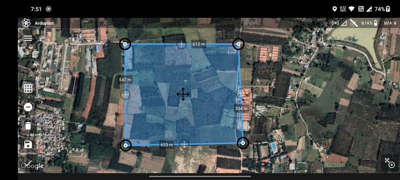
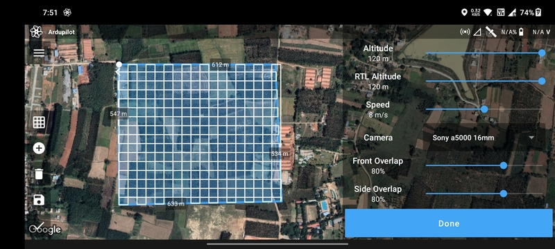
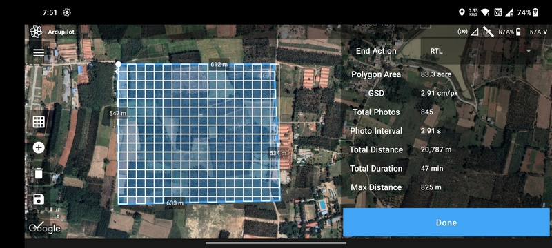

# Photo Double Grid Mission

Double grid drone missions, also known as crosshatch or perpendicular missions, are commonly used in aerial photography
and mapping applications where higher accuracy and resolution are required. In a double grid mission, the drone flies
over a designated area twice, along two perpendicular flight paths, capturing images or data points at predefined
intervals. This approach provides more overlap and redundancy in the data, allowing for more accurate and detailed 2D or
3D maps to be created. Double grid drone missions are particularly useful for applications such as land surveying,
construction site monitoring, and environmental monitoring where precise measurements and data are required.

## Create Mission

Select the `Photo Double Grid` mission type in the [Mission List Screen](/launchpad/overview/mission-list-screen.md) to
create the mission. This will open the [Mission Planning Screen](/launchpad/overview/mission-planning-screen.md).

## Drawing

Ensure that the `Add/Remove Vertices` button has a negative sign. Then tap anywhere on the screen a marker will be
displayed which marks the first vertex of the polygon.

Tap where you want to create the second vertex of the polygon. The blue line joining the two points is the boundary of
the polygon.

Repeat the process to add more vertices to the polygon.

Finally, tap on the first vertex to complete the polygon.

You can add or edit vertices as mentioned in [Mission Planning Screen](/launchpad/overview/mission-list-screen.md).

## Parameter Selection

The following parameters are available for a `Photo Double Grid` mission:

- `Altitude`
- `RTL Altitude`
- `Speed`
- `Camera`: Available camera types.
- `Front Overlap`: Percentage longitudinal overlap between the images.
- `Side Overlap`: Percentage lateral overlap between the images.
- `Heading Angle`: Angle of movement of the drone.
- `Flip Direction`: Exchange start and end points.
- `Fixed Yaw`: Enable to do the mission at a fixed yaw angle.
- `Yaw Angle`: Yaw angle in case of fixed yaw.
- `End Action`: Whether the drone should perform an `RTL` or `Hover` at the last waypoint.

Based on the parameters selected, the following values are calculated and displayed:

- `Polygon Area`
- `GSD`: Ground sampling distance.
- `Total Photos`: Estimated photos count.
- `Photo Interval`: Time interval between two consecutive photos.
- `Flight Distance`
- `Flight Duration`

The factors deciding the `Photo Interval` are `Altitude`, `Speed`, `Front Overlap`. Always make sure that the
combination of the above parameters results in a `Photo Interval` which is not too low, otherwise there's a chance that
the drone may miss photos.

The red color of the `Photo Interval` value shows that it is too low.

Once done, click on the `Done` button to move on to the [Flight Screen](/launchpad/overview/flight-screen.md).
