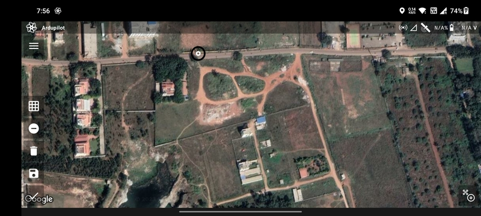
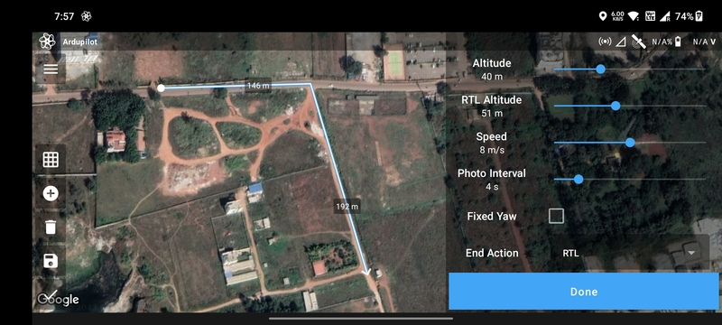

# Photo Line Mission

Photo line drone missions are commonly used in aerial photography applications where the drone needs to capture a
continuous series of images along a specific linear feature or area, such as a pipeline, a railway, or a road. In a line
photo drone mission, the drone flies along a predefined flight path, following the linear feature, and captures a series
of images at predefined intervals using its camera. This data can then be used to create high-resolution orthomosaic
maps or 3D models of the linear feature or area. Photo line drone missions are particularly useful in applications such
as pipeline inspection, highway inspection, or construction monitoring, where precise measurements and detailed imagery
are required.

## Create Mission

Select the `Photo Line` mission type in the [Mission List Screen](/launchpad/overview/mission-list-screen.md) to create
the mission. This will open the [Mission Planning Screen](/launchpad/overview/mission-planning-screen.md).

## Drawing

Ensure that the `Add/Remove Vertices` button has a negative sign. Then tap anywhere on the screen a marker will be
displayed which marks the first waypoint.

Tap where you want to create the second waypoint. The blue line joining the two points is the path that will be followed
by the drone.

Repeat the process to add more waypoints.

You can add or edit waypoints as mentioned in [Mission Planning Screen](/launchpad/overview/mission-list-screen.md).

## Parameter Selection

The following parameters are available for a `Photo Line` mission:

- `Altitude`
- `RTL Altitude`
- `Speed`
- `Photo Interval`: Time interval between the images.
- `Fixed Yaw`: Enable to do the mission at a fixed yaw angle.
- `Lock to Path`: Enable to take the yaw angle relative to the path.
- `Yaw Angle`: Yaw angle in case of fixed yaw.
- `End Action`: Whether the drone should perform an `RTL` or `Hover` at the last waypoint.

Based on the parameters selected, the following values are calculated and displayed:

- `Total Photos`
- `Total Distance`
- `Total Duration`
- `Max Distance`

Once done, click on the `Done` button to move on to the [Flight Screen](/launchpad/overview/flight-screen.md).
