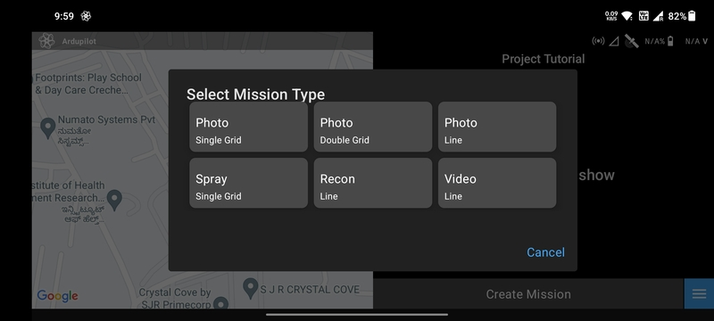
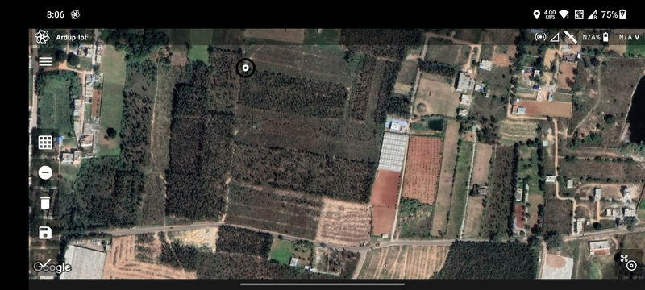
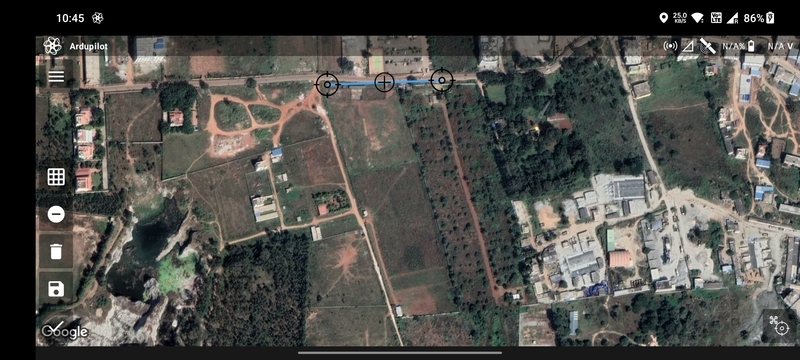
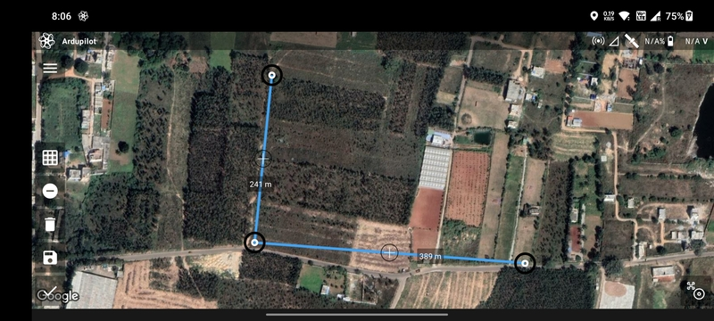
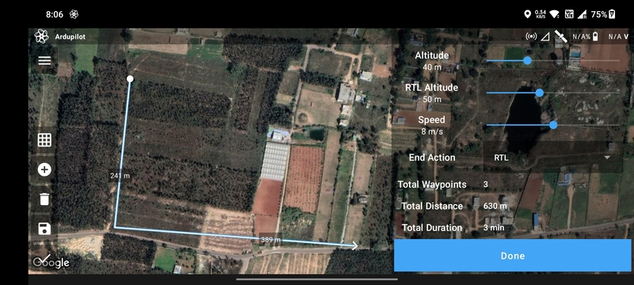

# Recon Line Mission

Recon line drone missions, also known as linear surveillance missions, are commonly used in surveillance and
reconnaissance applications where the drone needs to capture images or video along a specific linear feature or area,
such as a border, a coastline, or a pipeline. In a recon line drone mission, the drone flies along a predefined flight
path, following the linear feature. This mission is designed for automatic path following with manual payload control.
This data obtained can then be used to monitor and detect any activity or changes along the linear feature or area. Line
recon drone missions are particularly useful in applications such as border patrol, coastal surveillance, or
infrastructure security, where the drone needs to continuously monitor a specific path or feature for potential threats
or incidents.

## Create Mission

Select the `Recon Line` mission type in the [Mission List Screen](/launchpad/overview/mission-list-screen.md) to create
the mission. This will open the [Mission Planning Screen](/launchpad/overview/mission-planning-screen.md).

## Drawing

Ensure that the `Add/Remove Vertices` button has a negative sign. Then tap anywhere on the screen a marker will be
displayed which marks the first waypoint.

Tap where you want to create the second waypoint. The blue line joining the two points is the path that will be followed
by the drone.

Repeat the process to add more waypoints.

You can add or edit waypoints as mentioned in [Mission Planning Screen](/launchpad/overview/mission-list-screen.md).

## Parameter Selection

The following parameters are available for a `Recon Line` mission:

- `Altitude`
- `RTL Altitude`
- `Speed`
- `End Action`: Whether the drone should perform an `RTL` or `Hover` at the last waypoint.

Based on the parameters selected, the following values are calculated and displayed:

- `Total Waypoints`
- `Flight Distance`
- `Flight Duration`

Once done, click on the `Done` button to move on to the [Flight Screen](/launchpad/overview/flight-screen.md).
