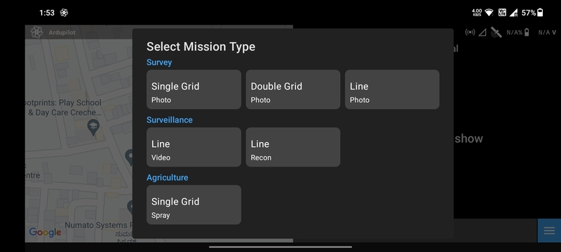
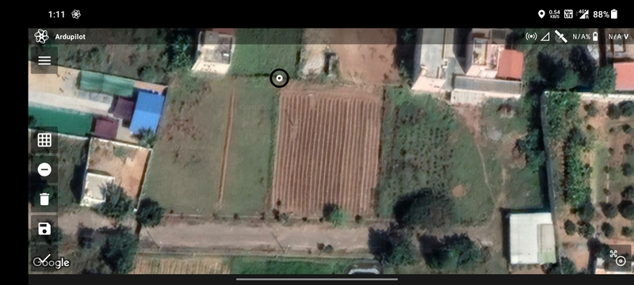
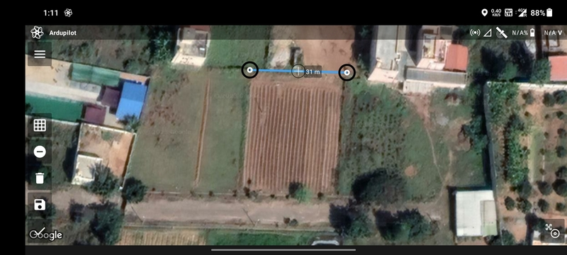
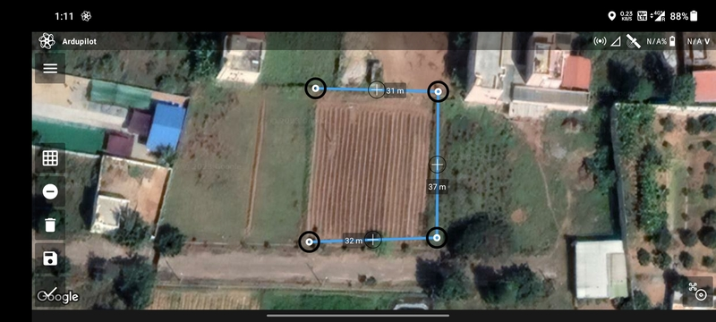
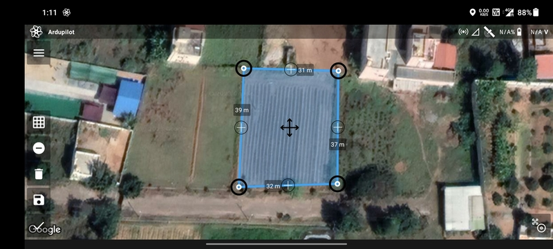
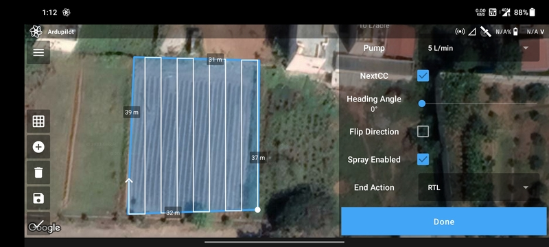
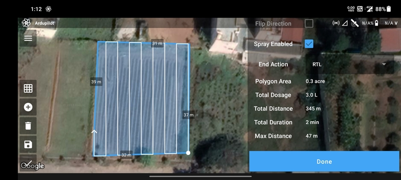
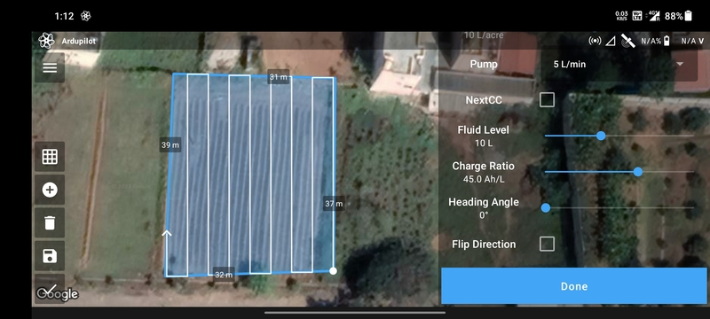

# Spray Single Grid Mission

The single grid spraying mission for drones is a game-changing approach in precision agriculture. By utilizing drones
equipped with advanced spraying capabilities, farmers can precisely target specific sections of their fields, optimizing
resource utilization and minimizing environmental impact. With high-precision GPS, obstacle detection sensors, and
sophisticated spraying systems, drones efficiently cover designated grids, delivering the right amount of inputs to each
area. This approach enhances pest and disease management, promotes sustainability, saves time and resources, and
contributes to the advancement of the agricultural industry.

## Create Mission

Select the `Spray Single Grid` mission type in the [Mission List Screen](/launchpad/overview/mission-list-screen.md) to
create the mission. This will open the [Mission Planning Screen](/launchpad/overview/mission-planning-screen.md).

## Drawing

Ensure that the `Add/Remove Vertices` button has a negative sign. Then tap anywhere on the screen a marker will be
displayed which marks the first vertex of the polygon.

Tap where you want to create the second vertex of the polygon. The blue line joining the two points is the boundary of
the polygon.

Repeat the process to add more vertices to the polygon.

Finally, tap on the first vertex to complete the polygon.

You can add or edit vertices as mentioned in [Mission Planning Screen](/launchpad/overview/mission-planning-screen.md).

## Parameter Selection

### Using NextCC (Recommended)

Installing a NextCC on your agricultural drone greatly simplifies the workflow of conducting automated missions, drone 
management and flight logging. The NextCC allows advanced flow meter integration and pump control that is extremely
accurate and easy to use. It provides first-class, robust and reliable support for Ardupilot and PX4 agricultural
systems that *just works* with minimal one-time configuration required. Follow the
[NextCC Agriculture Setup](/next-cc/agriculture.md) to configure the NextCC and integrate the flow meter.

The following parameters are available for a `Spray Single Grid` mission using NextCC:

- `Altitude`
- `RTL Altitude`
- `Speed`
- `Spray Width`: The gap between the flight path lines.
- `Acre Dosage`: The amount of liquid to be sprayed per acre.
- `Pump`: The available pump types.
- `NextCC`: Plan the mission using the simplified workflow provided by the NextCC.
- `Heading Angle`: Angle of movement of the drone.
- `Flip Direction`: Exchange start and end points.
- `Spray Enabled`: Whether the drone should actuate the spray during the flight.
- `End Action`: Whether the drone should perform an `RTL` or `Hover` at the last waypoint.

Based on the parameters selected, the following values are calculated and displayed:

- `Polygon Area`
- `Total Dosage`
- `Total Distance`
- `Total Duration`
- `Max Distance`

Once done, click on the `Done` button to move on to the [Flight Screen](/launchpad/overview/flight-screen.md).

### Without Using NextCC

The following parameters are available for a `Spray Single Grid` mission without using NextCC:

- `Altitude`
- `RTL Altitude`
- `Speed`
- `Spray Width`: The gap between the flight path lines.
- `Acre Dosage`: The amount of liquid to be sprayed per acre.
- `Pump`: The available pump types.
- `NextCC`: Plan the mission using the simplified workflow provided by the NextCC.
- `Fluid Level`: The amount of liquid in the tank.
- `Charge Ratio`: The factor used to calculate `BATT_X` capacity for the given fluid level.
- `Heading Angle`: Angle of movement of the drone.
- `Flip Direction`: Exchange start and end points.
- `Spray Enabled`: Whether the drone should actuate the spray during the flight.
- `End Action`: Whether the drone should perform an `RTL` or `Hover` at the last waypoint.

Based on the parameters selected, the following values are calculated and displayed:

- `Polygon Area`
- `Total Dosage`
- `Total Distance`
- `Total Duration`
- `Max Distance`

Once done, click on the `Done` button to move on to the [Flight Screen](/launchpad/overview/flight-screen.md).
