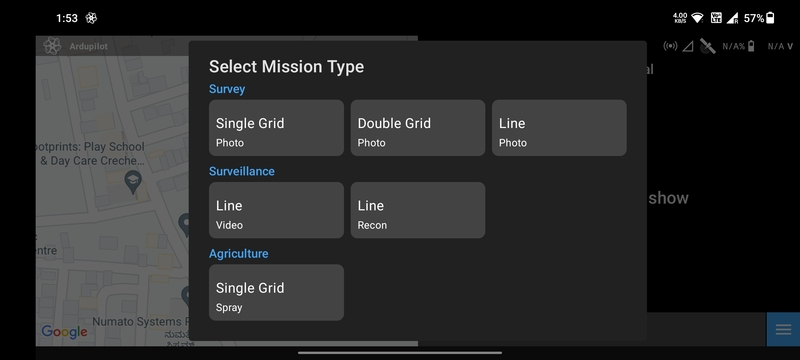
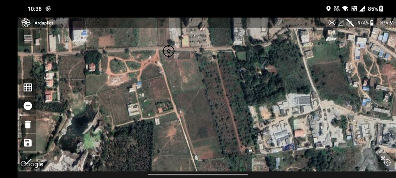
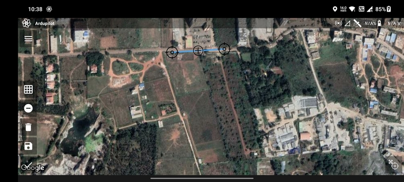
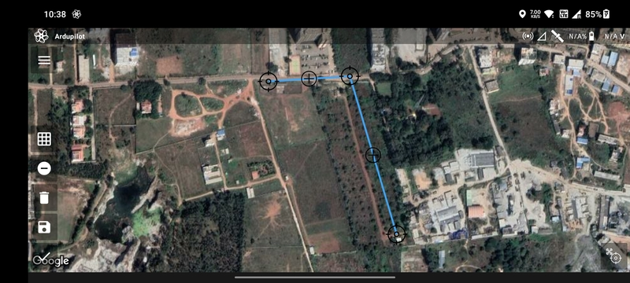
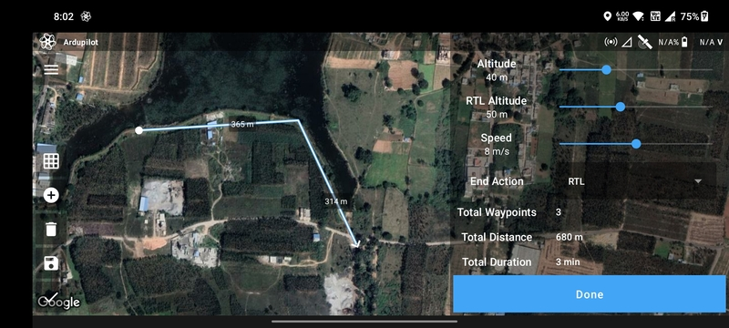

# Video Line Mission

Video line drone missions, also known as linear missions, are commonly used in applications where the drone needs to
capture a continuous video stream of a specific linear feature or area, such as a pipeline, a highway, or a coastline.
In a video line drone mission, the drone flies along a predefined flight path, following the linear feature, and
captures a continuous video stream from its camera. This data can then be used for inspection, monitoring, or analysis
purposes. Video line drone missions are particularly useful in applications such as infrastructure inspection, wildlife
tracking, or coastal erosion monitoring, where the drone needs to follow a specific path or feature and capture a
continuous video stream for further analysis.

## Create Mission

Select the `Video Line` mission type in the [Mission List Screen](/launchpad/overview/mission-list-screen.md) to create
the mission. This will open the [Mission Planning Screen](/launchpad/overview/mission-planning-screen.md).

## Drawing

Ensure that the `Add/Remove Vertices` button has a negative sign. Then tap anywhere on the screen a marker will be
displayed which marks the first waypoint.

Tap where you want to create the second waypoint. The blue line joining the two points is the path that will be followed
by the drone.

Repeat the process to add more waypoints.

You can add or edit waypoints as mentioned in [Mission Planning Screen](/launchpad/overview/mission-list-screen.md).

## Parameter Selection

The following parameters are available for a `Video Line` mission:

- `Altitude`
- `RTL Altitude`
- `Speed`
- `End Action`: Whether the drone should perform an `RTL` or `Hover` at the last waypoint.

Based on the parameters selected, the following values are calculated and displayed:

- `Total Waypoints`
- `Flight Distance`
- `Flight Duration`

Once done, click on the `Done` button to move on to the [Flight Screen](/launchpad/overview/flight-screen.md).
