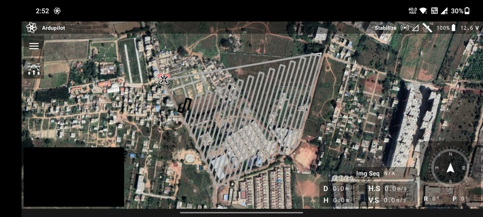
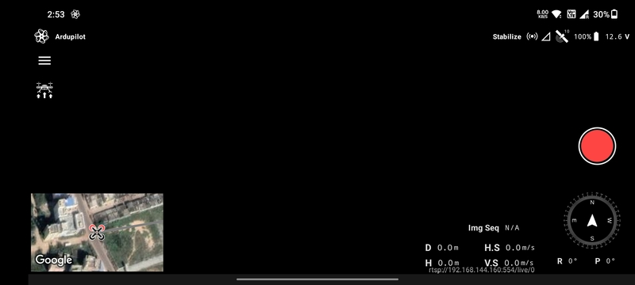
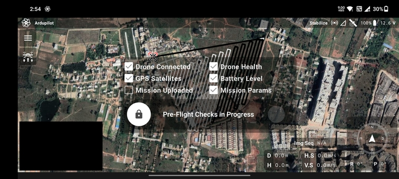
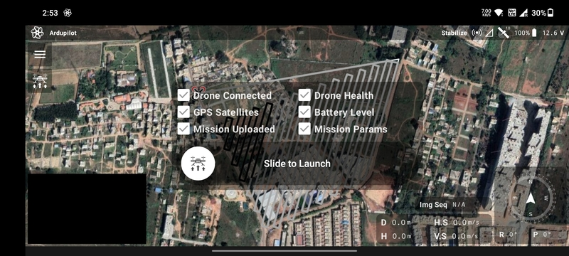
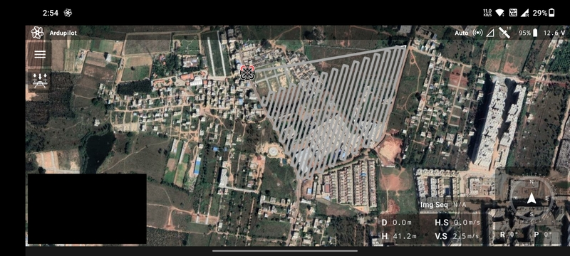
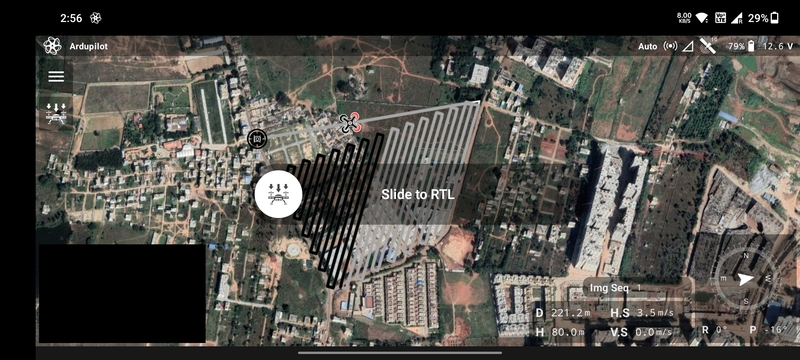
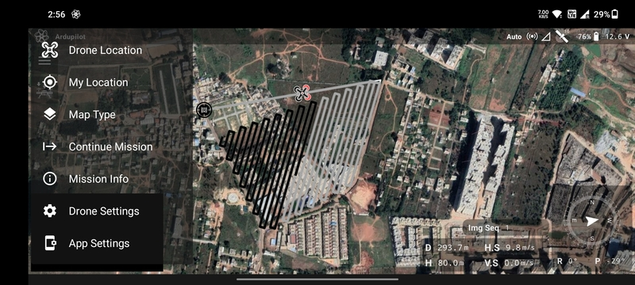

# Flight Screen

This is the screen which provides the interface to takeoff, conduct in-flight operations and land the drone.

Flights can be conducted in two ways:

- Manual flight
- Automated mission flight

In the case of an automated mission, the map is zoomed into the path planned in the
[Mission Planning Screen](./mission-planning-screen.md).

## Heads-up Display

At the bottom right part of the screen are present some important in-flight telemetry details:

- `D`: Distance from home/takeoff location.
- `H`: Altitude from home/takeoff location.
- `H.S`: Horizontal speed.
- `V.S`: Vertical speed.
- `Compass`: Heading of the drone.
- `R`: Roll angle.
- `P`: Pitch angle.
- `Img Seq`: Index of the photo taken in a particular power cycle.
- `F`: Flow Rate
- `C`: Fluid Consumed

## Camera

The video stream can be viewed in the camera present at the bottom left part of the screen. You can click it to expand
the camera and replace the map with it.

The video stream URL can be configured in the [App Settings](/launchpad/app-settings)

### Take Photo Button

The red colored button at the mid right part of the camera screen can be used to take a photo from the drone. When
clicked, two actions take place:

- If the camera on the drone is configured to take commands from the flight controller to take photos, then it will take
  a photo and save in on the camera's SD card.
- A screen shot of the camera is taken and saved on the transmitter/phone.

## Upload Button

The icon below the menu button on the top left corner of the screen is the mission upload button. The pre-flight checks
will be conducted when you tap it.

### Pre-Flight

There are 6 pre-flight checks that need to ticked so that you can launch the drone.

- `Drone Connected`: The drone connected to the transmitter.
- `Drone Health`: Indicates if the sensors are calibrated and ready for flight.
- `GPS Satellites`: The GPS is receiving data from enough satellites to estimate the position correctly.
- `Battery Level`: Whether there is enough battery to execute the mission.
- `Mission Uploaded`: Indicates if the mission has been uploaded to the drone.
- `Mission Params`: The mission parameters have been updated.

### Slide to Launch

Once the pre-flight checks are successful, you can swipe the slider to the right to start the flight.

## Takeoff

The drone will arm and takeoff once `Slide to Launch` is triggered. You can clearly see the drone on the map and the
distance from the home/takeoff location and its altitude. The red color represents the front side of the drone.

## Return to Launch

When in air, the mission upload button becomes the RTL button. You can tap it to access the `Slide to RTL` slider.

## Menu

The menu button on the top left corner has the following options:

- `Drone Location`: Zoom into the location of the drone.
- `My Location`: Zoom into the location of the user.
- `Map Type`: Switch between satellite and normal map types.
- `Continue Mission`: Continue the mission from the last waypoint in case it was interrupted.
- `Mission Info`: Information about the current mission.
- [`Drone Settings`](/launchpad/drone-settings)
- [`App Settings`](/launchpad/app-settings)

