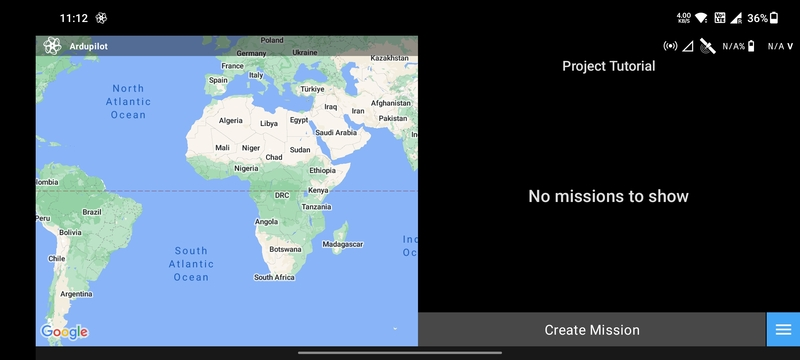
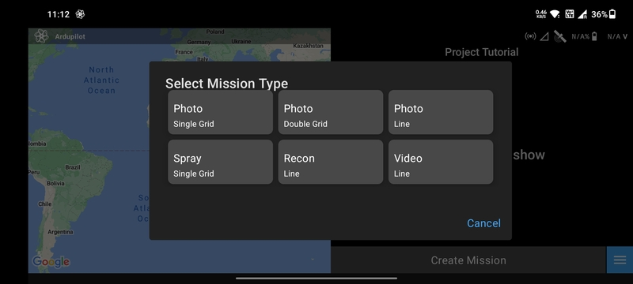
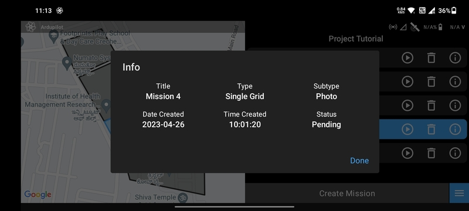
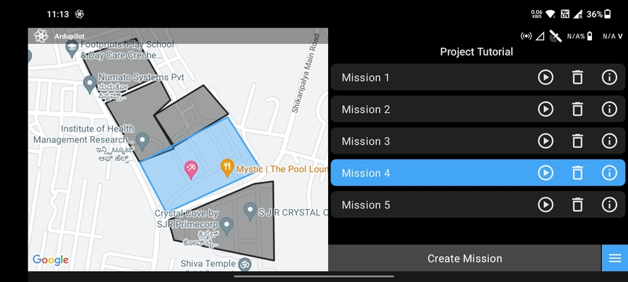
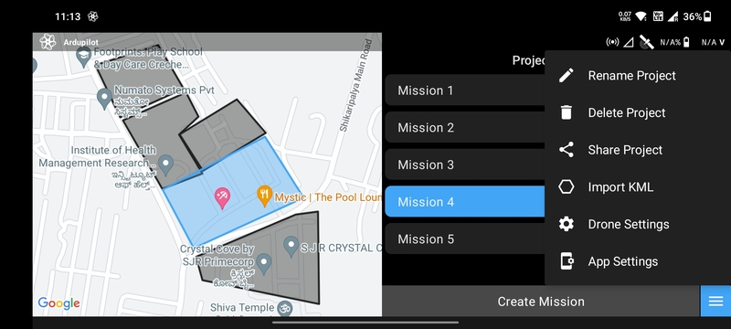

# Mission List Screen

The Mission List Screen helps you manage several autonomous missions inside a particular project.

## Create Mission

LaunchPad currently offers 6 different types of automated missions:

- [`Photo Single Grid`](../mission-planning/single-grid-photo.md)
- [`Photo Double Grid`](../mission-planning/double-grid-photo.md)
- [`Photo Line`](../mission-planning/line-photo.md)
- `Spray Single Grid`
- [`Video Line`](../mission-planning/line-video.md)
- [`Recon Line`](../mission-planning/line-recon.md)

## Mission Item Buttons

Each mission item has three buttons.

- `Play`: Loads the [Mission Planning Screen](./mission-planning-screen.md) with the mission.
- `Delete`: Delete the mission.
- `Info`: Show the mission information.

## Map

If you already have missions created then the world map on the left will zoom into that area. Tapping on a mission will
highlight the corresponding polygon.

## Menu

The menu button is present at the bottom right corner of this screen. When tapped on, it shows the following menu items:

- `Rename Project`
- `Delete Project`
- `Share Project`
- `Import KML` (Use it to import KMZ as well)
- [`Drone Settings`](/launchpad/settings/drone-settings.md)
- [`App Settings`](/launchpad/settings/app-settings.md)

