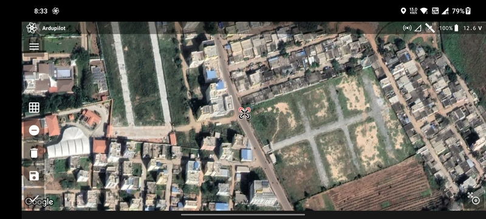
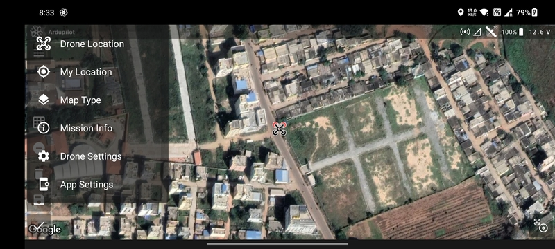
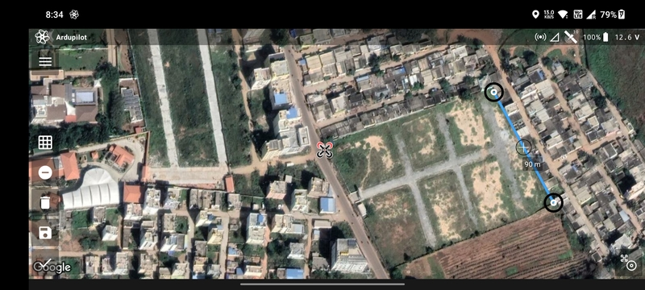

# Mission Planning Screen

The Mission Planning Screen allows you to create the flight path and set the required parameters for the specific
mission type. To keep the workflow simple, this screen shows only the parameters that are required by the mission type.
For more details on each mission type, refer the [Mission Planning](/launchpad/mission-planning) section.

## Menu

Top left corner has another menu button that opens up the following options:

- `Drone Location`: Zoom into the location of the drone.
- `My Location`: Zoom into the location of the transmitter.
- `Map Type`: Switch between satellite and normal map types.
- `Mission Info`: Information about the current mission.
- [`Drone Settings`](/launchpad/settings/drone-settings.md)
- [`App Settings`](/launchpad/settings/app-settings.md)

## Drawing Buttons

The drawing buttons are present at the bottom left and right of the screen.

The buttons on the bottom left are (from top to bottom):

- `Single Tap Geo-fence`
- `Add/Remove Vertices`
- `Delete Drawing`
- `Save Drawing`
- `Proceed to Mission Parameters`

The button on the bottom right is `Add Vertex at Drone Location`.

## Drawing Basics

To create the drawing ensure that the `Add/Remove Vertices` icon is a negative sign. Then tap on the map where you want
to create the first vertex. A black target will be appear at the location.

Next, tap on the map where you want to add the next vertex. A blue line will be created which will join the two
vertices.

You can also click the `Add Vertex at Drone Location` (bottom right) to add a vertex at the drone's current location.

Based on the mission type, you can either create a line or a polygon. These are covered in detail in the
[Mission Planning](/launchpad/mission-planning) section.

## Mission Parameter Sheet

Based on the mission type, the user is prompted different types mission parameters. These are covered in detail in the
[Mission Planning](/launchpad/mission-planning) section.

## Done Button

Once the planning is done, you can click the `Done` button to move on to the [Flight Screen](./flight-screen.md).
