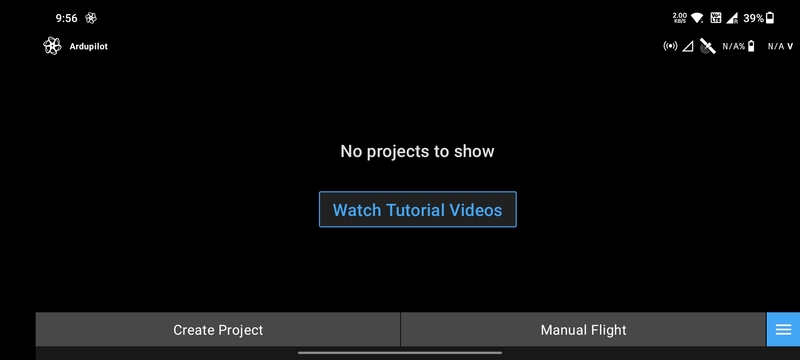
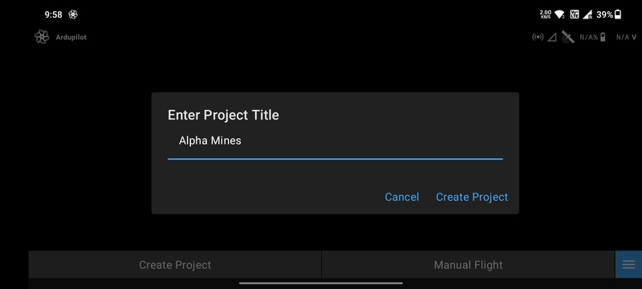
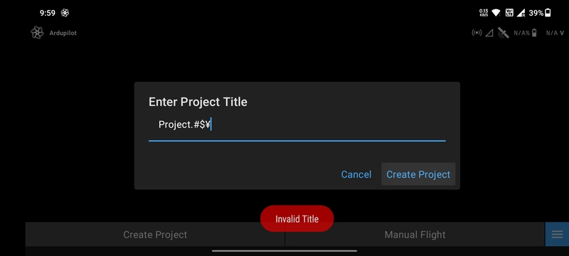
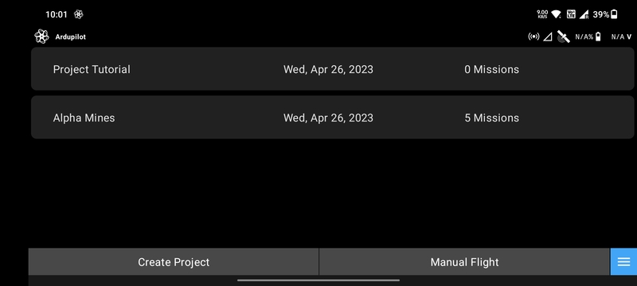
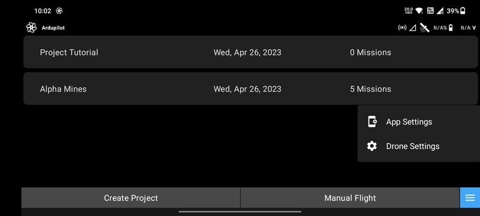

# Project List Screen

The Project List Screen is the screen that lets you create and manage several projects. A project is a set of missions
conducted in an area.

For example, a project can be created separately for a survey at a specific area in Delhi and it can contain various
autonomous missions for that particular area. Another project can contain only missions for a survey in some Mumbai
area.

## Create Project

Lets you create a particular project which can contain several missions.

The `Enter Project Title` dialog will appear when you tap the `Create Project` button.

You can name the project using any combination of alphabets and numbers only, no special characters are allowed in the
naming of the project. An invalid title error as shown in the above image will be displayed. Examples of some special
characters are `!@#$%^&*"'`

## Project List

When you create a project, it gets added to the project list. Clicking on any project will take you to the the
[Mission List Screen](./mission-list-screen.md) for that project.

## Manual Flight

If you want to fly the drone manually this option must be selected. This will take you to the
[Flight Screen](./flight-screen.md).

## Menu

The blue button with three horizontal white lines represents the menu button.

The two options that can be selected when you tap the menu button are the
[`App Settings`](/launchpad/settings/app-settings.md) and
[`Drone Settings`](/launchpad/settings/drone-settings.md).
