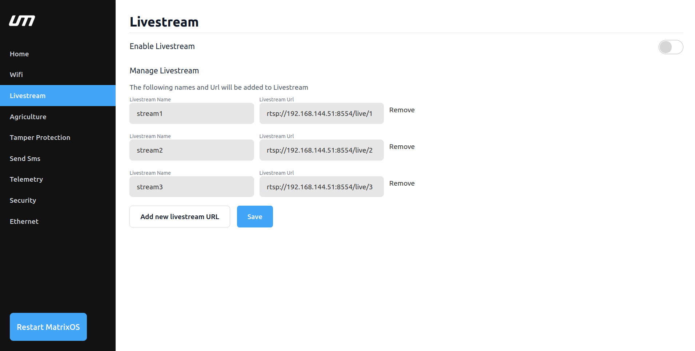
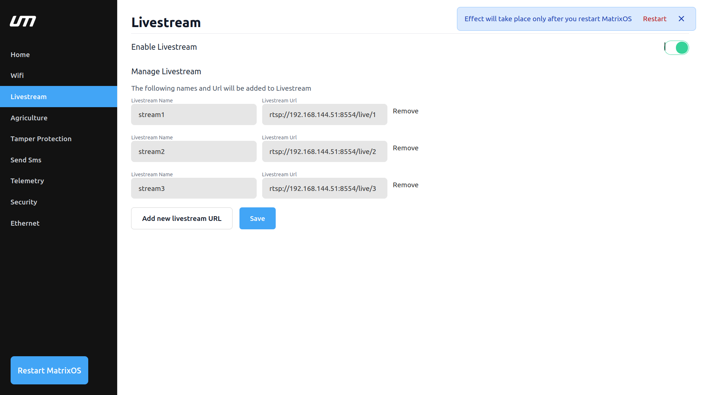
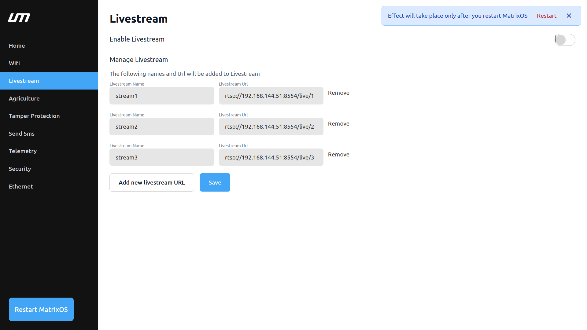
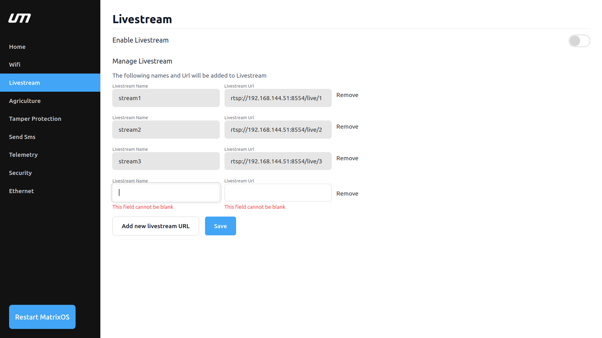
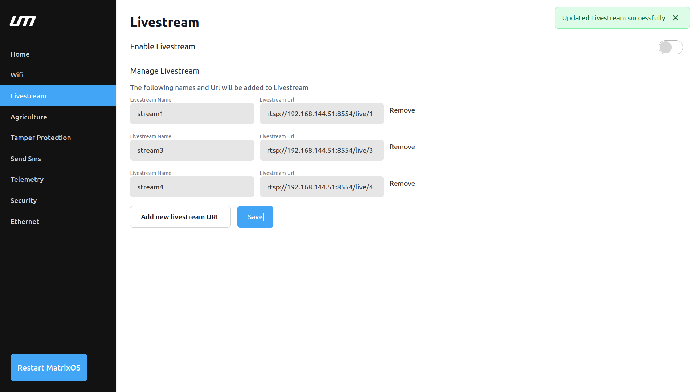

# Livestream

Users are able to manage video streaming functionality with MatrixCC's Livestream feature.

- Please refer to the first time setup to open the [MatrixOS Dashboard](/matrix-os/getting-started/first-time-setup.md)

### Livestream Screen

## Features
  
The livestream feature provides users with two important funtionality :

- Enable or disable the Livestream feature.
- Manage livestream details (name and URL)

### Enable Livestream

When you activate the toggle under Enable Livestream section, MatrixOS will be able to read the Livestream URLs and begin video streaming.

*Note* : If there is no Livestream URLs, you need to add new livestream   

**Note**: After enabling livestream, restart MatrixOS Dashboard. 

### Disable Livestream

When you deactivate the toggle under Enable Livestream section, MatrixOS will not read the Livestream URLs and stop video streaming.

**Note**: After diabling livestream, restart MatrixOS Dashboard. 

### Manage Livestream

You can add or remove livestream name and URLs depending on your requirements.

### Steps to add new livestream :

  - Click on add new livestream URL. Two text boxes will appear, labelled Livestream Name and Livestream URL.

  - You must fill in the blanks with the necessary information.

  
*Note* : Be cautious while filling the livestream URL.

### Save Livestream URL

It lets users to save the newly added URL and name.

## Usage

After enabling/disabling the Livestream feature, make sure to restart the MatrixOS Dashboard for the changes to take effect.

To add a new livestream, provide the livestream name and URL in the Manage Livestream section.

To remove an existing livestream, select the desired livestream from the list and click on remove button.
