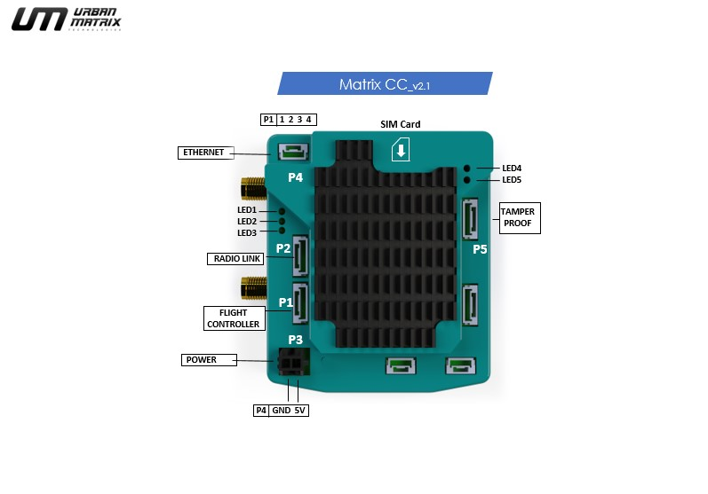
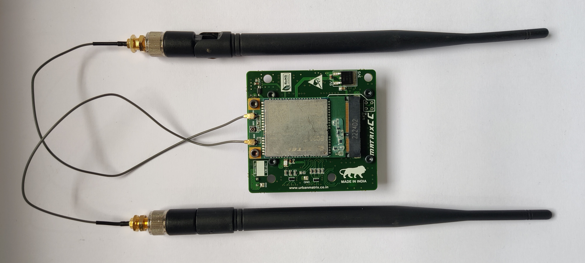
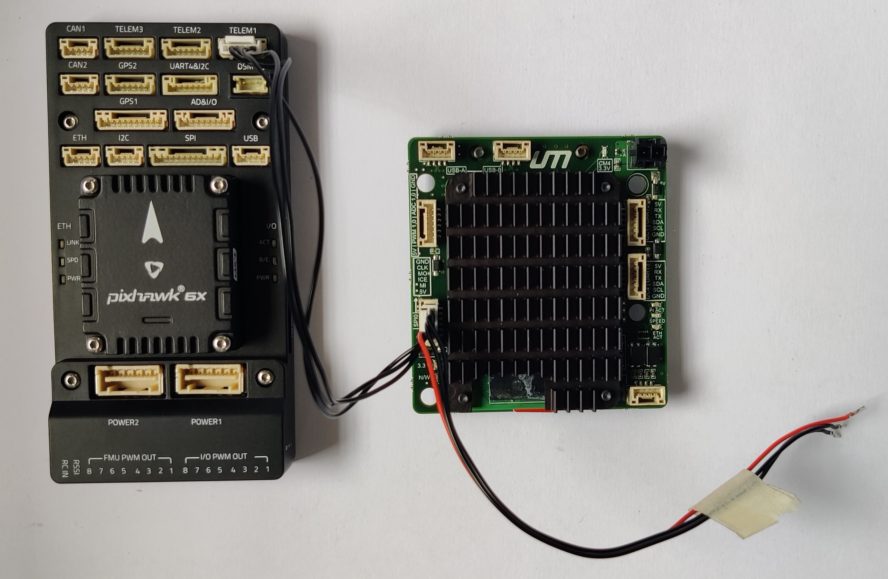
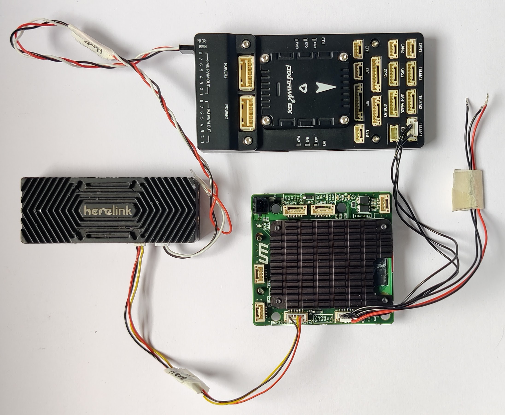
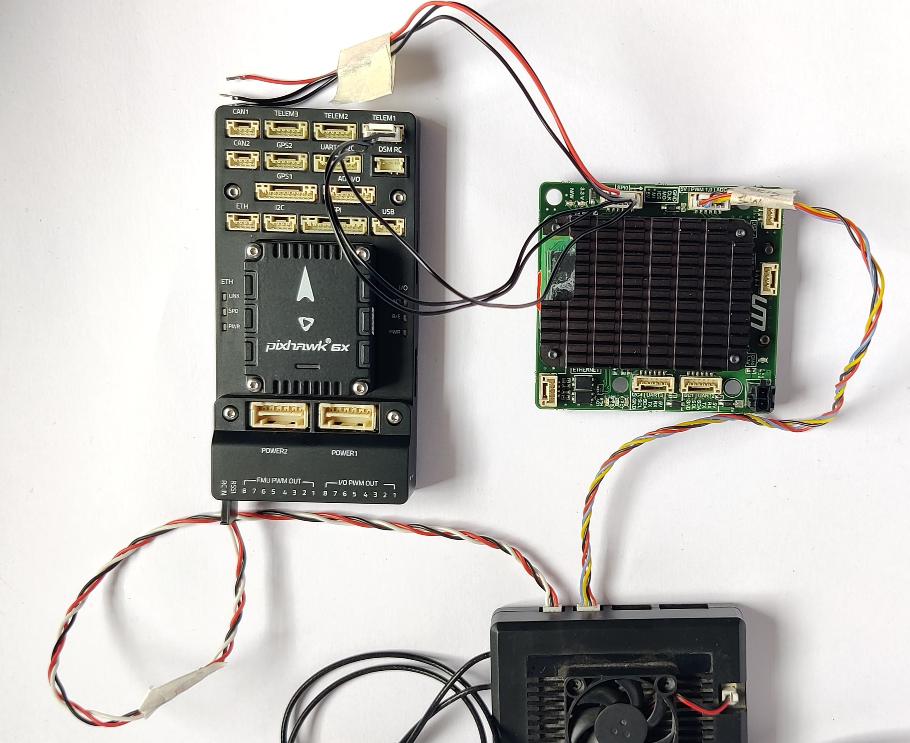
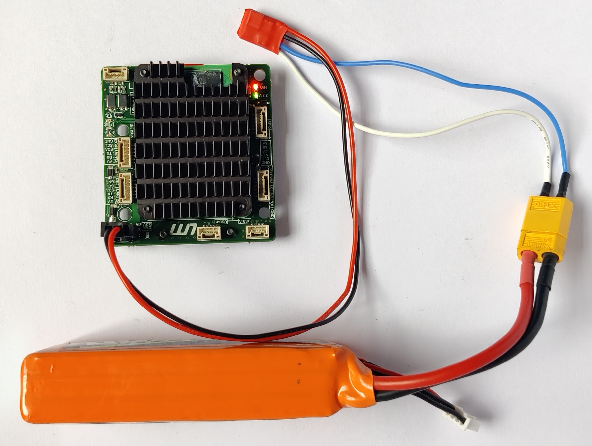
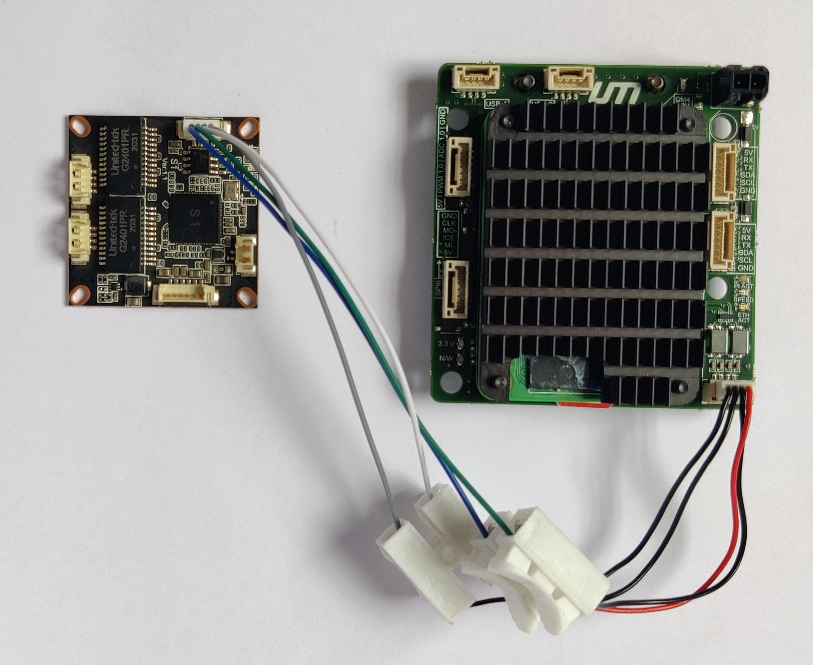
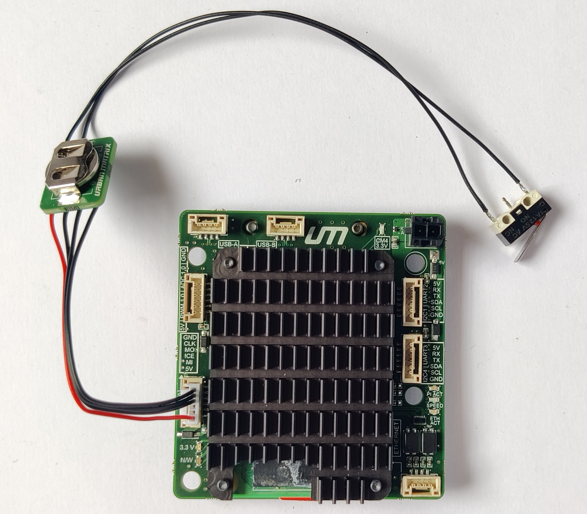
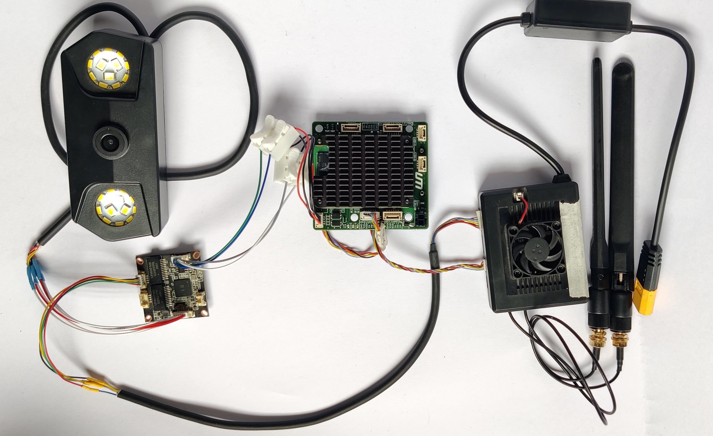

# Integration

In this section you'd find the electronics integration of main components. 

## Antennas
- Connect the 2 antennas of the Quectel module (MAIN | DIV)
- For simplicity the antennas have been removed in the following sections.

## P1 : FLIGHT CONTROLLER
- Cable : 6 pin
- Connect the P1 port to your autopilot on the TELEM port.

## P2 : RADIO LINK
- Cable : 6 pin
- Connect the P2 port of the MatrixCC to the air unit using a UART cable. 
- *Standard Connection:* Connect the air unit to your autopilot 

## P3 : POWER
- Cable : Power Connector 
- Power requirements : 5V | 2A (max)
- Use the power connector given in the box to power the MatrixCC.
- Always plug in antenna before powering on​

## P4 : ETHERNET (optional)
- Cable : 4 pin
- Connect the P4 port of the MatrixCC to the P1 port of the Ethernet Switch. 

## P5 : TAMPER PROOFING (optional)
- Cable : 6 pin 
- Connect the tampering proofing module to the port P5 using the cable given in the box. 

## Payload (optional)
This section explains the integration of MatrixCC with an IP camera. To illustrate an example the IP camera used is a SIYI MK15 IP67.
*USB type:* Use the 4 pin JST to USB connector.
Power supply should not be given into 4-pin and 6-pin JST connectors (use them as output only)​​

### IP camera 

- An IP camera, or Internet Protocol camera, can transmit and receive data via a computer network and the internet.
- Connect it to the ethernet switch. 
- In case of the SIYI MK15 IP camera, connect the wire of the camera to the P4 port of the Ethernet Switch. 
- Connect the air unit to the ethernet switch [to receive the video feed on [launchpad](/docs/launchpad/introduction.md)] 
