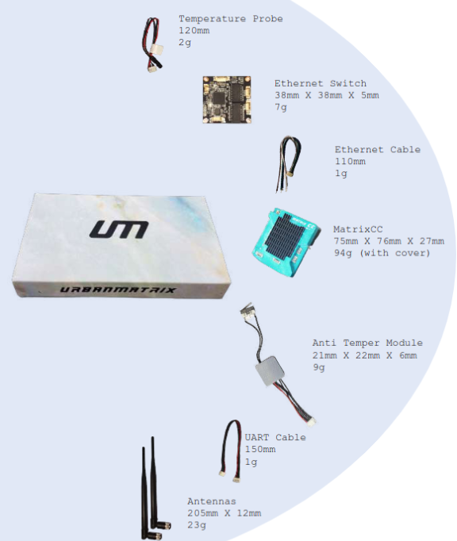

# What's in the box?

## Matrix CC

MatrixCC is an indigenous Companion Computer that is an addition to a usual flight controller. It transforms your drone to a 4G enabled drone system with endless new possibilities.

## Antennas

The antennas are a crucial component along with the MCC to extend the range of the wireless signal and improve its quality, allowing for better connectivity and faster data transfer speeds. 

## Cables

 - UART
 - JST with lock
 - Power cable for MCC 

## Tamper Proofing Solution (optional)

## Ethernet Switch (optional)

