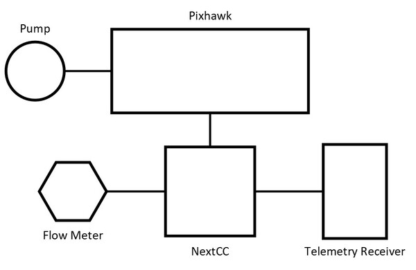
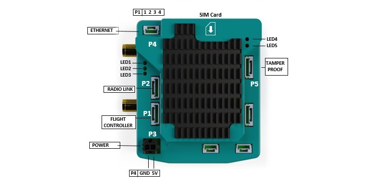
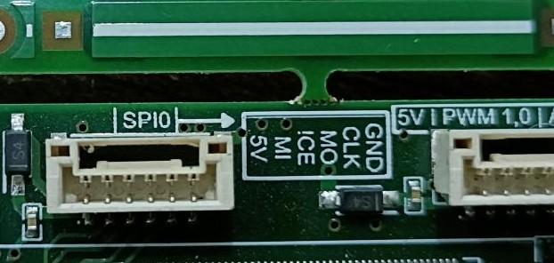
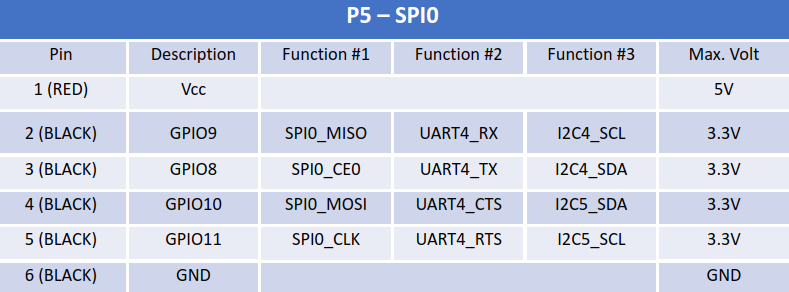
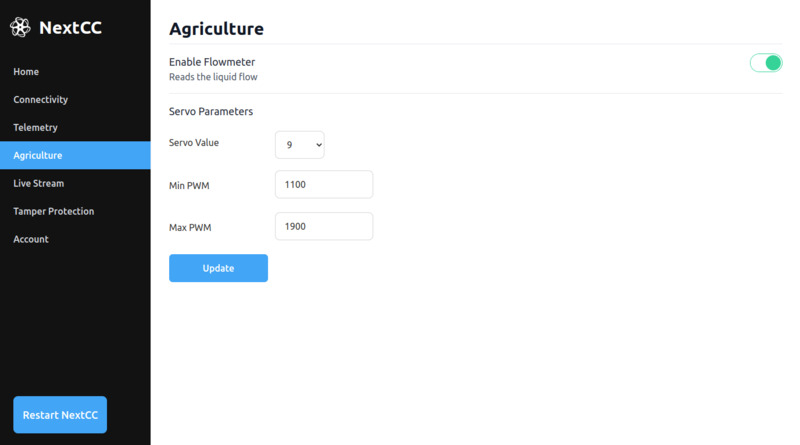

# Agriculture

NextCC provides reliable integration of PWM based agricultural flow meters. It can read the pump signals, process them
and forward the flow rate and amount of fluid consumed to [LaunchPad](/launchpad). Currently, the agricultural setup is
only supported on Ardupilot systems.

## Setup

Complete the NextCC [Hardware Setup](/next-cc/getting-started/hardware-setup.md) before starting the agriculture setup.

The simplified schematics of the connections is given below.

### Pump Integration with Pixhawk

Follow the [Ardupilot Crop Sprayer](https://ardupilot.org/copter/docs/sprayer.html) documentation to integrate the pump
with the Pixhawk.

### Flow Meter Integration with NextCC

A flow meter has three pins, i.e., VCC, GND and signal.

- Use the VCC and the GND pins to power the flow meter. *Do not use the NextCC to power the flow meter*.
- Connect the signal pin of the flow meter to the **P5 (SPI0)** port of the NextCC. The signal pin goes to the pin
  marked as **ICE** on the port. In the pin out diagram, it is mentioned as the **GPIO8** pin.
- This is the same port to which the tamper proof module is connected, so you can simply put the signal wire to the
  tamper proof module connector. Alternatively, you can create a new connector.

### Software Configuration

Follow the NextCC [Software Setup](/next-cc/getting-started/software-setup.md) to access the `NextCC Dashboard`. Go to
the `Agriculture` section.

- Click the switch to enable the flow meter reading.
- Set the `Servo Value` to the servo pin of your **pump**.
- Set the `Min PWM` to the minimum pump servo output.
- Set the `Max PWM` to the maximum pump servo output.
- Click the `Update` button to save the settings.
- Restart the drone.

## Calibration

Refer the `Flow Meter Calibration` section in the LaunchPad [Drone Settings](/launchpad/drone-settings) for
instruction on how to calibrate the flow meter.

## Spray Mission

Refer the [Spray Single Grid Mission](/launchpad/mission-planning/spray-single-grid.md) page for instructions on how to
plan automated spray missions with LaunchPad.
