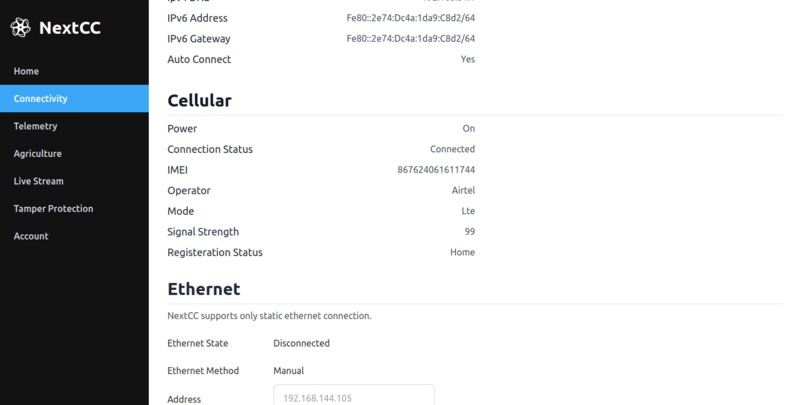

# Cellular

This section lists the important information related to the LTE module.

- `Power`: Whether the LTE module is powered on or not.
- `Connection Status`: Whether the NextCC is connected to the internet or not.
- `IMEI`: The IMEI number of the NextCC.
- `Operator`: The network provider name.
- `Mode`: The current operation mode.
- `Signal Strength`: The current signal strength. It ranges between 0 and 100.
- `Registration Status`: The SIM registration status.

