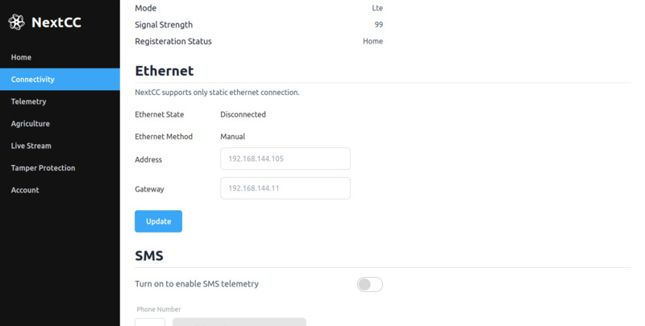

# Ethernet

NextCC supports ethernet connectivity which is primarily used to access video stream of IP cameras connected to it.

Only static ethernet connection is supported by the system.

## Changing the Ethernet Address and Gateway

1. Enter the new IPv4 address of NextCC in the `Address` text box.
2. Enter the IPv4 address of the new connection gateway in the `Gateway` text box.
3. Click on the `Update` button.
4. Wait for a few seconds for the NextCC to update the connection.
