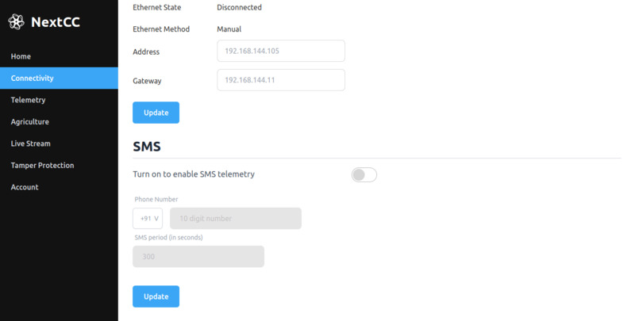

# SMS

For operations such as long range delivery, a drone can fly through areas where the LTE strength is weak. In such cases,
the NextCC automatically shifts between 5G, 4G, 3G and 2G based on the availability of the network. As an added
redundancy, the NextCC can also be configured to send its location via SMS directly to a phone number if no internet is
available.

## Enabling SMS Telemetry

- Click the switch to turn on *SMS Telemetry*. 
- Enter the `Phone Number` to which the messages are to be sent.
- Set the `SMS Period` (the time gap between two messages).
- Click the `Update` button.
