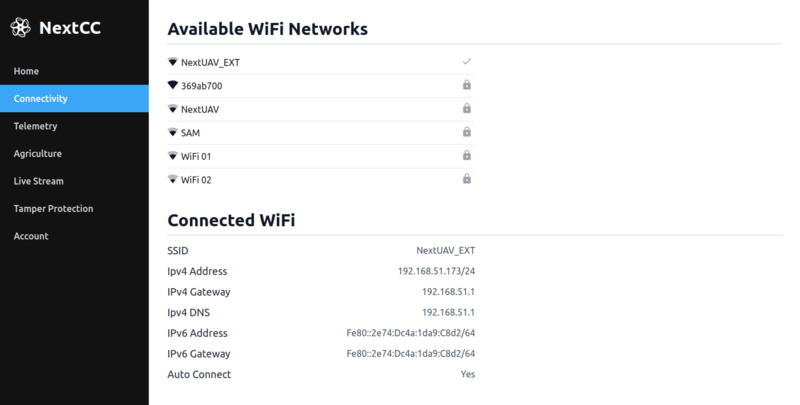

# WiFi

A list of WiFi networks that the NextCC is able to detect is available in the WiFi section. By default, the NextCC is
connected to `NextUAV_EXT`, but you can connect it to any of the networks available to it.

## Connecting to a WiFi Network

To connect to a new network, just click it on the list and enter the password when prompted. Wait for a few seconds for
the NextCC to connect to the new network.

If the connection is successfully made, the current page will become inactive because the machine which is used to
access the NextCC dashboard is not connected to the same network as the NextCC. Connect your machine to the same new
network and then you can access the NextCC dashboard again. The NextCC will take the new network as the default network
now.

If the connection attempt fails, then the NextCC will connect back to the old network.

