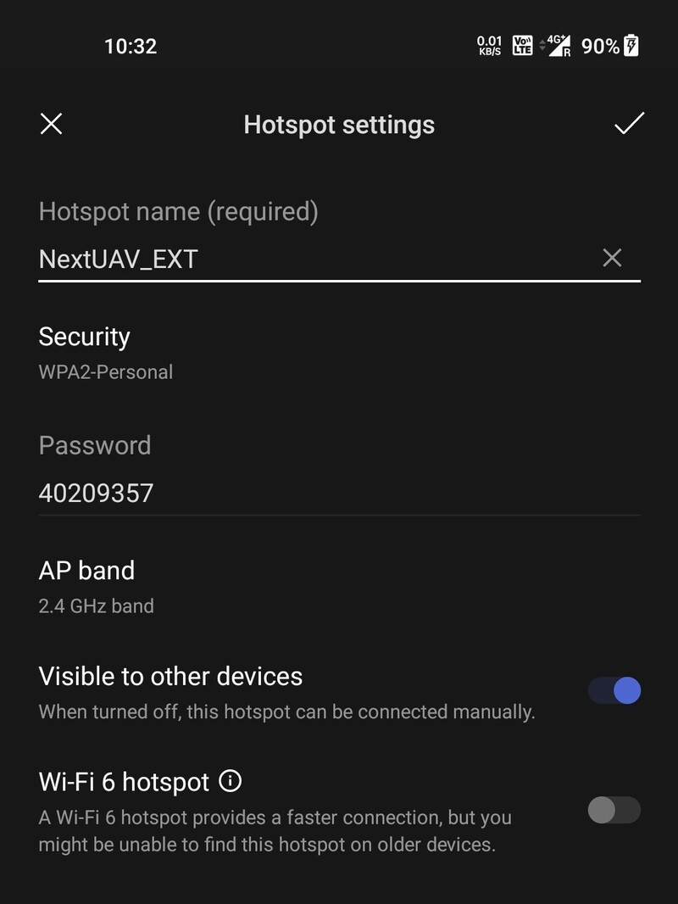
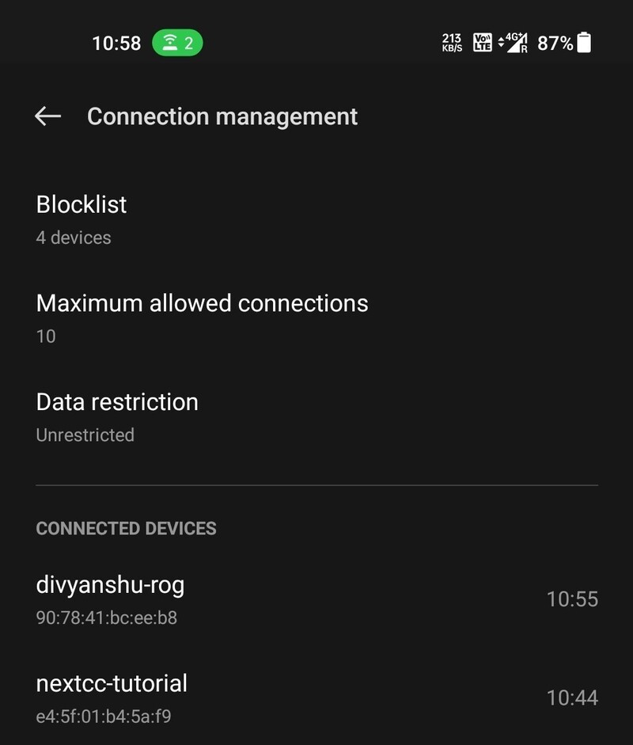

# WiFi

A list of WiFi networks that the NextCC is able to detect is available in the WiFi section. By default, the NextCC will
connect to `NextUAV_EXT`, but you can connect it to any of the networks available to it.

## Connecting to a WiFi Network

To connect to a new network, click it on the list and enter the password when prompted. Wait for a few seconds for
the NextCC to connect to the new network.

If the connection is successfully made, the current page will become inactive because the machine which is used to
access the NextCC dashboard is not connected to the same network as the NextCC. Connect your machine to the same new
network and then you can access the NextCC dashboard again. The NextCC will take the new network as the default network
now.

If the connection attempt fails, then the NextCC will connect back to the old network.

## Connecting to the Default WiFi

Go to the hotspot settings on your phone and configure it with the following details:
- Name: `NextUAV_EXT`
- Password: `40209357`

This is the network to which the NextCC connects out of the box. You can later configure the NextCC to connect to your
office/personal WiFi.

Power on the NextCC and wait for it to connect to the hotspot. Connect another computer to the same hotspot to access
the NextCC Dashboard.

In this case, the network name of the NextCC is `nextcc-tutorial`.

Open the browser on your computer and go to `<nextcc-network-name>.local:8000`. In this case, the link is
`nextcc-tutorial.local:8000`. This will open up the NextCC Dashboard login page.

The network name of your NextCC will not change.
