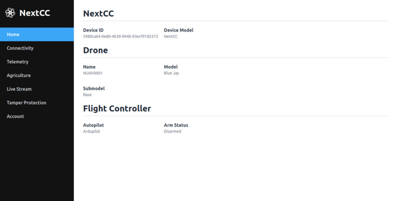

# Dashboard Home

## NextCC

The NextCC hardware details.

- `Device ID`: The unique NextCC hardware ID.
- `Device Model`: The model name of the NextCC.

## Drone

The drone information set by the manufacturer through the [NextConsole](/next-console).

- `Name`: The name of the drone assigned to the NextCC.
- `Model`: The drone model assigned by the manufacturer.
- `Submodel`: The drone submodel assigned by the manufacturer.

## Flight Controller

The details of the flight controller connected to the NextCC.

- `Autopilot`: The flight controller autopilot firmware.
- `Arm Status`: Whether the drones is armed or not.
