# Hardware Setup

NextCC acts as a bridge between the flight controller and the telemetry air unit. It does the task of message processing
and validation for added security missing in general MAVLink systems.

Apart from this, the NextCC can be connected with Internet Protocol (IP) cameras to provide low latency live video
stream

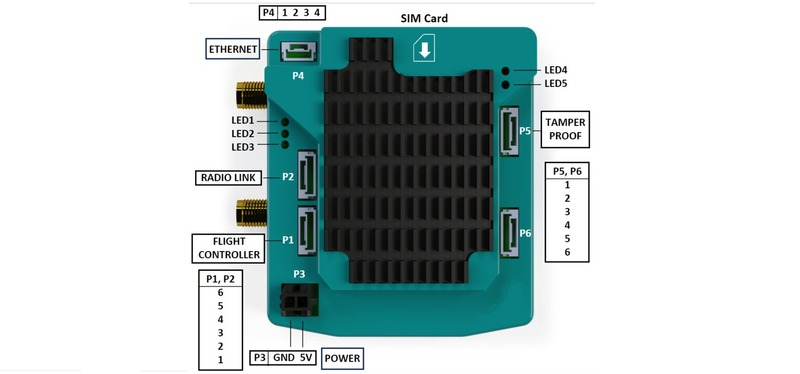

## Antennas

Connect the 2 antennas to the **MAIN** and **DIV** pins of the cellular module.

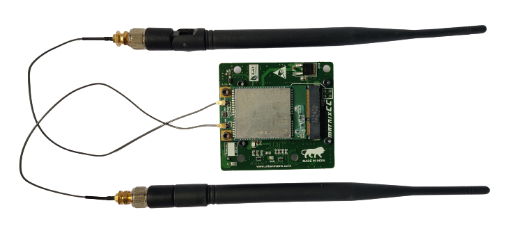

*Note: For simplicity the antennas have been removed in the following sections.*

## SIM Card

The SIM card should be inserted as shown.

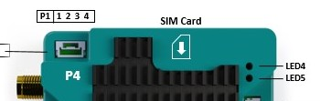

## Flight Controller \[P1\]

- Take a 6 pin JST cable provided with the NextCC and make sure that the for Rx, Tx and GND pins correspond with the Tx,
  Rx and GND of the Pixhawk respectively.
- Remove the other wires (especially the 5V wire).
- Set the baud rate of any of Pixhawk's **TELEM** ports to **57600** and make sure that it is configured as a
  **MAVLink 2** output.
- Use the JST cable to connect the **TELEM** port of the Pixhawk with the **P1 (UART2)** port of the NextCC.

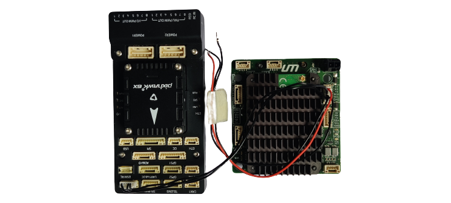

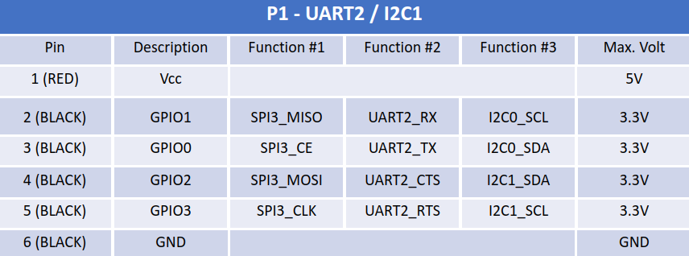

*Note: Do not power the Pixhawk or any other component using the 5V provided by the NextCC.*

## Telemetry Receiver \[P2\]

- Take a 6 pin JST cable provided with the NextCC and make sure that the for Rx, Tx and GND pins correspond with the Tx,
  Rx and GND of the telemetry receiver respectively.
- Remove the other wires (especially the 5V wire).
- Use the JST cable to connect the **UART/Serial** port of the telemetry receiver with the **P2 (UART3)** port of the
  NextCC.

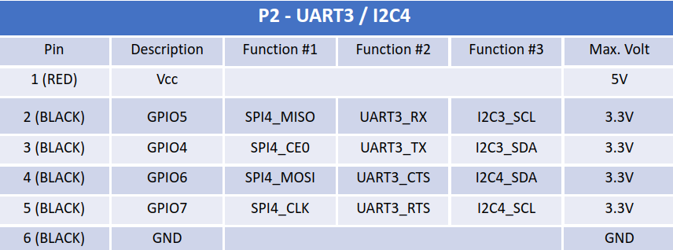

*Note: The pin out for a telemetry receiver is different from a Pixhawk. Please refer to the pin out diagrams of the*
*receiver and NextCC. The users may have to swap the Rx and Tx cables in the JST connector.*

### Herelink

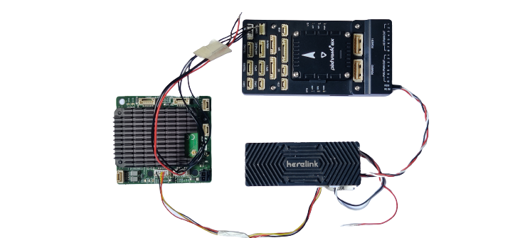

### MK15

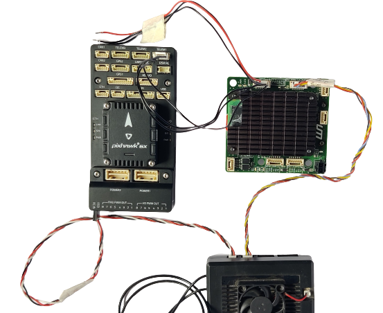

## Power \[P3\]

- NextCC requires a **constant 5V** supply with a **max current of 2A**.
- Use the power connector given in the box to power the NextCC or solder the wires to the base pad of the power input.
- Make sure that there are no voltage fluctuations that may occur in flight.
- Plug in the cellular antennas before powering on​.

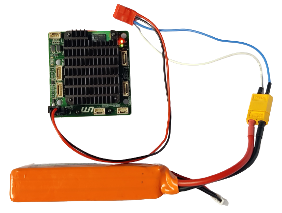

## Network Hub \[P4\] (Optional)

- Connect any port of the Network Hub with the **P4 (ETH)** port of the NextCC.
- Use the pin out diagram to connect an IP camera to the network hub.

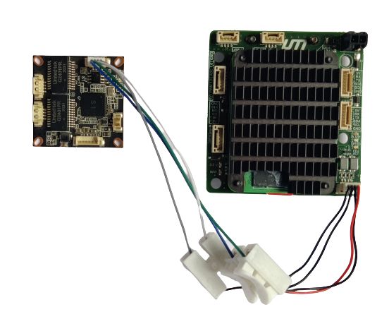

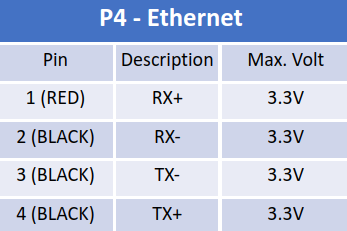

## Tamper Proof Module \[P5\] (Optional)

- Connect the tamper proof module to the **P5** port.
- Connect one or more triggers modules in parallel to the S1 and S2 ports marked on the tamper proof module.

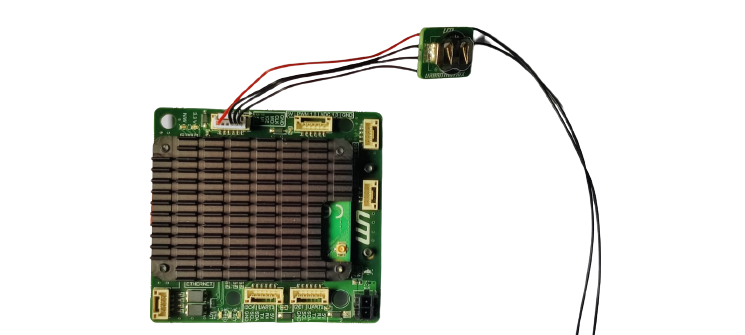

