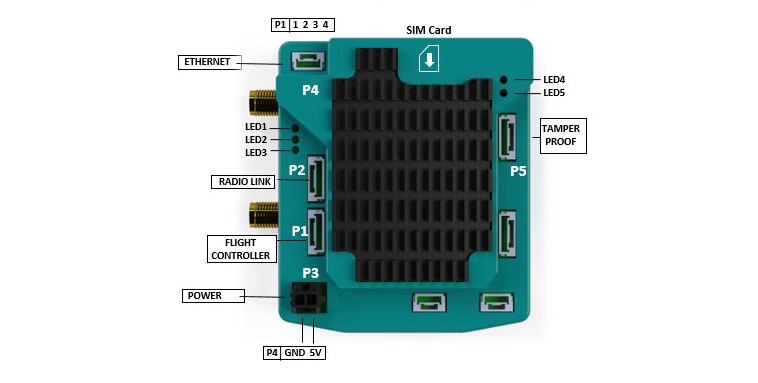
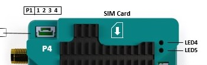
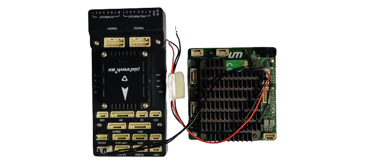
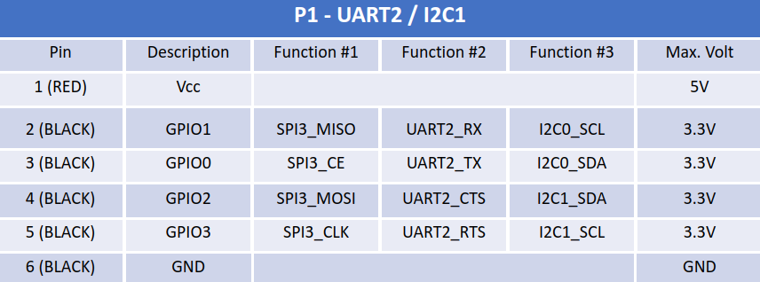

# Setup Hardware

## Antennas

Connect the 2 antennas to the **MAIN** and **DIV** pins of the cellular module.

*Note: For simplicity the antennas have been removed in the following sections.*

## SIM Card

The SIM card should be inserted as shown.

## Flight Controller (P1)

- Take a 6 pin JST cable provided with the NextCC and make sure that the for RX, TX and GND pins correspond with the TX,
  RX and GND of the Pixhawk respectively.
- Remove the other wires (especially the 5V wire).
- Set the baud rate of any of Pixhawk's **TELEM** ports to **57600** and make sure that it is configured as a
  **MAVLink 2** output.
- Use the JST cable to connect the **TELEM** port of the Pixhawk to the **P1 (UART2)** port of the NextCC.

*Note: Do not power the Pixhawk or any other component using the 5V provided by the NextCC.*

## Telemetry Receiver (P2)

- Cable : 6 pin
- Connect the P2 port of the NextCC to the air unit using a UART cable.
- *Standard Connection:* Connect the air unit to your autopilot.

Please refer to the pin out diagram below. [*Note- Rx Tx may be swapped*]

### Herelink

### MK15

## P3 : POWER

- Cable : Power Connector
- Power requirements : 5V | 2A (max)
- Use the power connector given in the box to power the NextCC.
- Always plug in antenna before powering on​

## P4 : NETWORK HUB (optional)

- Cable : 4 pin
- Connect the P4 port of the NextCC to the P1 port of the Network Hub.

## P5 : TAMPER PROOF MODULE (optional)

- Cable : 6 pin
- Connect the tampering proofing module to the port P5 using the cable given in the box.
- Connect the trigger module to the S1 and S2 ports.

## PAYLOAD (optional)

This section explains the integration of NextCC with an IP camera. To illustrate an example the IP camera used is a SIYI MK15 IP67.

### IP camera

- An IP camera, or Internet Protocol camera, can transmit and receive data via a computer network and the internet.
- Connect it to the network hub.
- In case of the SIYI MK15 IP camera, connect the wire of the camera to the P4 port of the Network Hub.
- Connect the air unit to the network hub [to receive the video feed on [launchpad](/launchpad/introduction.md)]

