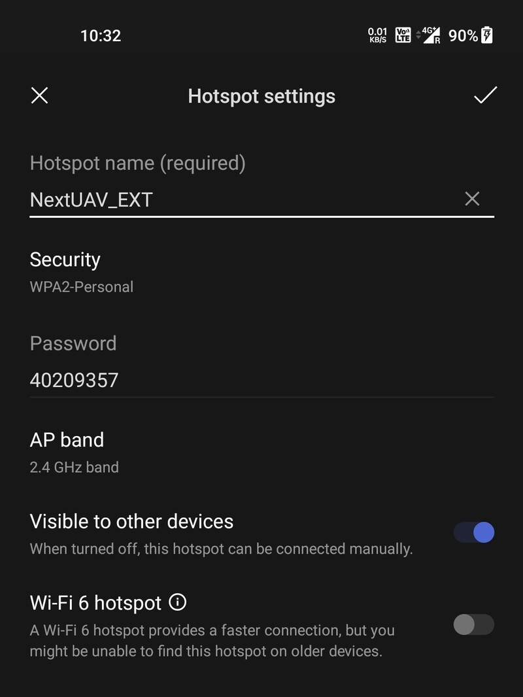
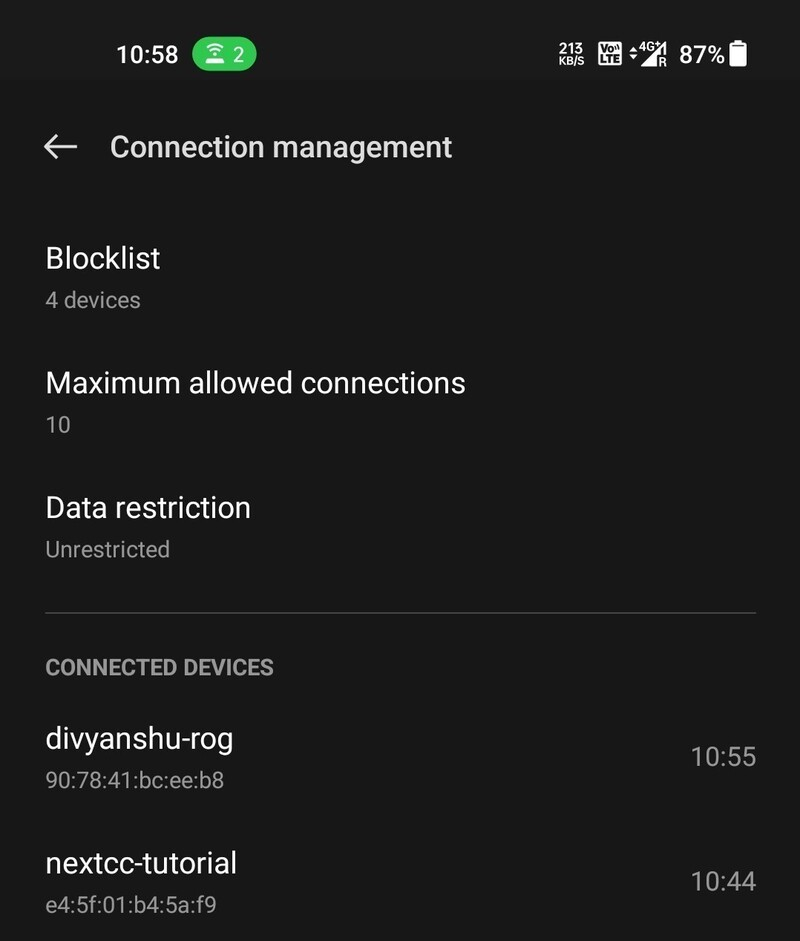
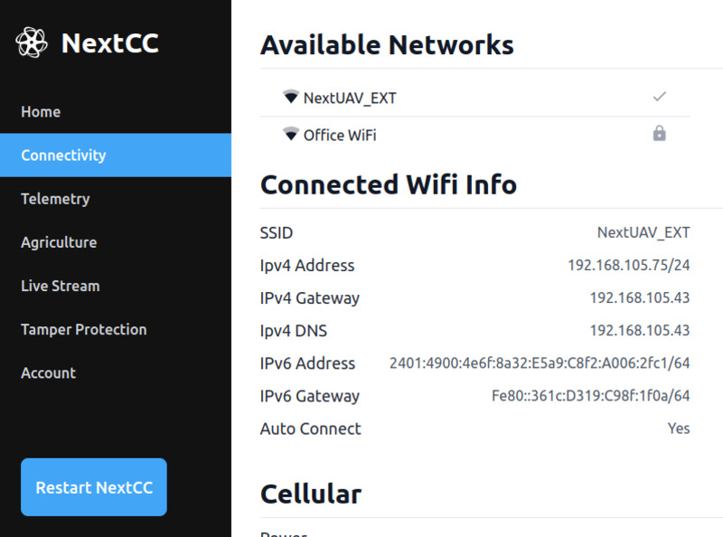

# Software Setup

The NextCC Dashboard allows drone manufacturers to configure the NextCC according to their needs. Manufacturers can
check and update the tamper status of the drone, configure live stream and agriculture sensor settings, and much more,
without having to understand or work with the internals of the NextCC operating system (NextOS).

It is a simple and secure dashboard that can be opened on any web browser. Think of it as setting up your WiFi router.

## NextCC Dashboard

This section explains how you can access the dashboard for the first time and set it up so that it becomes easy for you
to access it later.

Go to the hotspot settings on your phone and configure it with the following details:
- Name: `NextUAV_EXT`
- Password: `40209357`

This is the network to which the NextCC connects out of the box. You can later configure the NextCC to connect to your
office/personal WiFi.

Power on the NextCC and wait for it to connect to the hotspot. Connect another computer to the same hotspot to access
the NextCC Dashboard.

In this case, the network name of the NextCC is `nextcc-tutorial`.

Open the browser on your computer and go to `<nextcc-network-name>.local:8000`. In this case, the link is
`nextcc-tutorial.local:8000`. This will open up the NextCC Dashboard login page.

The default credentials are:
- Username: `admin`
- Password: `password`

*Note: It is recommended that you change the login credentials for the security of your drone system. Refer the*
*[Account](/next-cc/account.md) page for instructions on how to do so.*

Once logged in, you can go to the [WiFi](/next-cc/connectivity/wifi.md) settings in the
[Connectivity](/next-cc/connectivity) page and connect the NextCC to your office/personal WiFi. The NextCC will then
connect to that WiFi by default.

The network name of your NextCC will not change.
