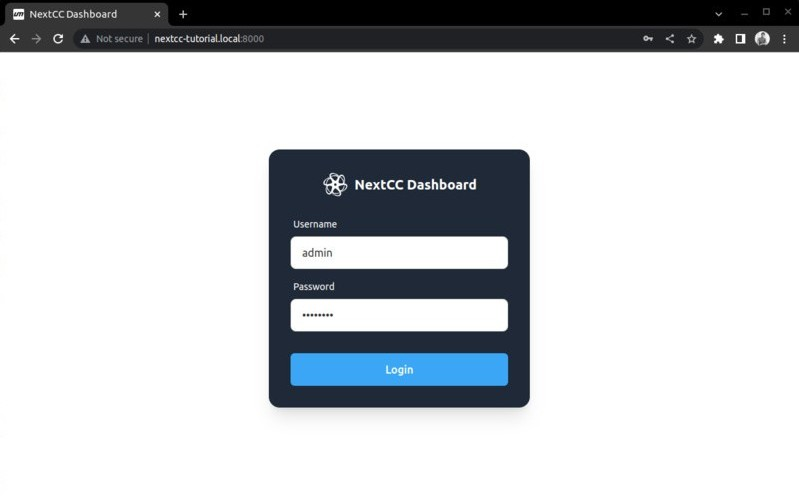

# Software Setup

The NextCC Dashboard allows drone manufacturers to configure the NextCC according to their needs. Manufacturers can
check and update the tamper status of the drone, configure live stream and agriculture sensor settings, and much more,
without having to understand or work with the internals of the NextCC operating system (NextOS).

It is a simple and secure dashboard that can be opened on any web browser. Think of it as setting up your WiFi router.

## NextCC Dashboard

This section explains how you can access the dashboard for the first time and set it up so that it becomes easy for you
to access it later.

Power on the NextCC and wait a few seconds for it to boot up.

The NextCC creates a **WiFi hotspot** to which you can connect your phone or computer. The hotspot name will show up as
something like `NextCC_26d8527e82c7`, based on the ID of your NextCC. The **password** for connecting to this hotspot is
`nextcc123`.

Once connected, open the browser and go to `192.168.0.1:8000` to access the NextCC Dashboard.

The default credentials are:
- Username: `admin`
- Password: `password`

*Note: It is recommended that you change the login credentials for the security of your drone system. Refer the*
*[Account](/next-cc/account.md) page for instructions on how to do so.*
