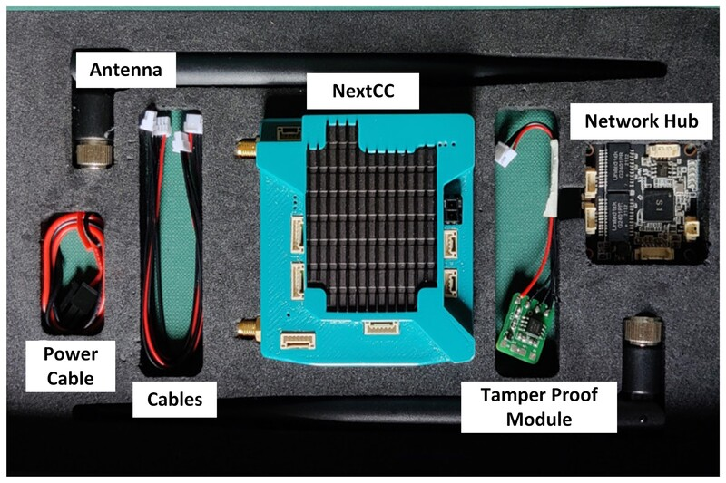

# What's in the box?

## NextCC

NextCC is an indigenous Companion Computer that is an addition to a usual flight controller. It has an in-built 4G
module and a powerful processor with several high-speed communication interfaces.

## Antennas

Antennas play a critical role in extending the range and enhancing the quality of wireless signals, leading to improved
connectivity and faster data transfer speeds.

## Cables

- 6-pin JST connectors
- 4-pin JST connectors
- Power cable for the NextCC
- Antenna cables

## Tamper Proof module (optional)

A tamper-proof module will prevent the drone from arming the motors if any tamper in the hardware is detected, such as
opening the top, bottom, or side plates. If any tamper is detected, and alert is sent to the drone's manufacturer. To
regain the ability to arm, the user must contact the manufacturer.

## Network Hub (optional)

An Network Hub connects multiple devices to the same network by physically connecting them to the switch using cables.
This allows the NextCC to interface with multiple devices on the drone including the cameras while keeping the number of
cables to a minimum.

