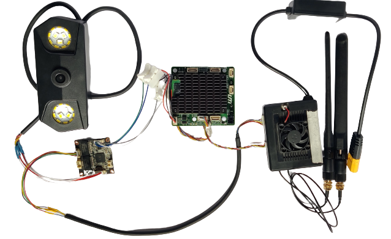

# IP Camera with SIYI MK15

## Video Feed only on NextConsole

- Connect the IP camera to the **ETH** port of the NextCC.

## Video Feed on both NextConsole and GCS

- For this, the IP camera, the telemetry receiver and the NextCC should be connected with the network hub.
- Follow the instructions to [connect the network hub with the NextCC](/next-cc/getting-started/hardware-setup.md).
- Connect the IP camera to one of the ports of the network hub. 
- Connect the video port of the MK15 telemetry receiver with the network hub.

