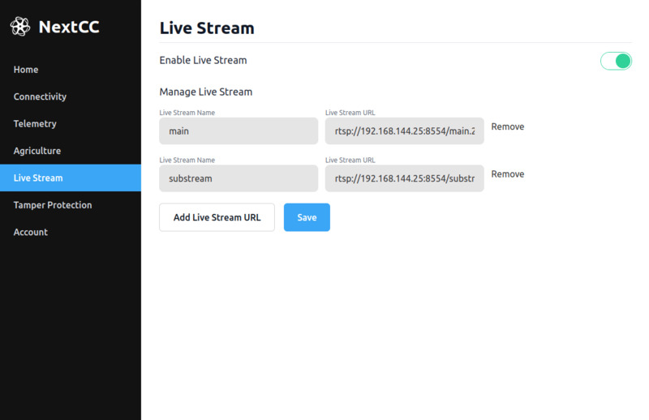

# Software Configuration

Users can easily connect Internet Protocol (IP) cameras to the **ETH** port of the NextCC and configure it to take the
video from the source URL and re-stream it to view the live stream on NextConsole.

Follow the NextCC [Software Setup](/next-cc/getting-started/software-setup.md) to access the `NextCC Dashboard`. Go to
the `Live Stream` section.

- Click the switch to enable live streaming.
- Add the live stream name and the RTSP URL according to your camera.
- Click on the save button.
- Restart the NextCC.

Refer to the subsections for the different configurations of NextCC, camera and telemetry air unit that can be made
according to the user needs.
