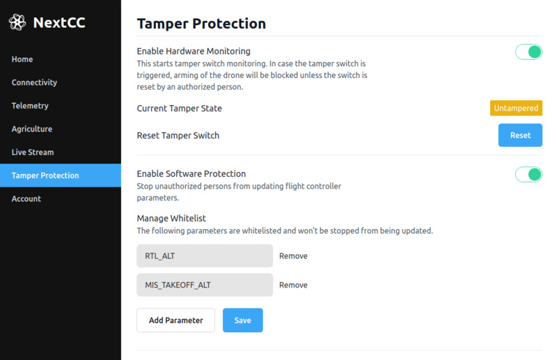

# Hardware

NextCC provides a hardware tamper protection module that drone manufacturers can use to monitor if their drone has been
tampered with or not. If a tamper is detected, then the NextCC can stop the drone from arming.

To keep things development friendly, drone manufacturers can disable this feature while they are are developing and
testing the drone. They can enable it when they need to give the drone to their clients.

## Setup

- Connect the tamper proof module to the **P5** port.
- Connect one or more triggers modules in parallel to the S1 and S2 ports marked on the tamper proof module.
- Place the triggers on different places in your drone where it can be opened.

- Open the `Tamper Protection` section of the `NextCC Dashboard`.
- Click the `Enable Hardware Monitoring` switch.
- Restart the NextCC.

## Status Monitoring

The status can be one of `Tampered` and `Untampered`. Even if the NextCC is not powered up and the tamper protection
switch is trigger by a person, the tamper is registered. This can be viewed by the drone manufacturer as shown in the
image.

The status will remain `Tampered` until it is reset by the drone manufacturer.

Motor arming will only be allowed while the status is `Untampered`.

## Resetting

Drone manufacturers can reset the tamper protection module's status from `Tampered` to `Untampered`.

- Make sure that the module is connected to the NextCC.
- Click on the `Reset` button.
- Wait till the status changes back to `Untampered`.
