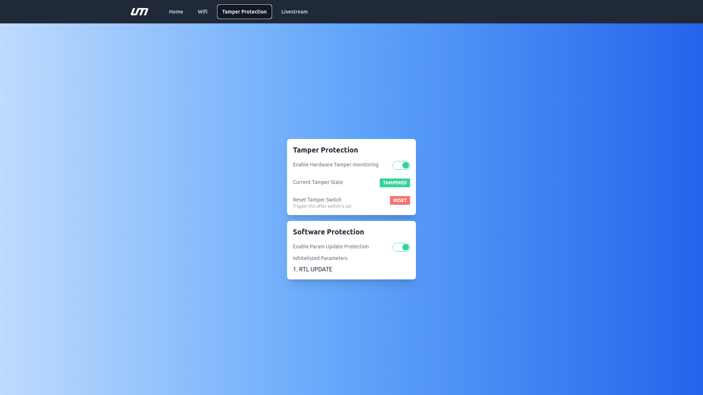
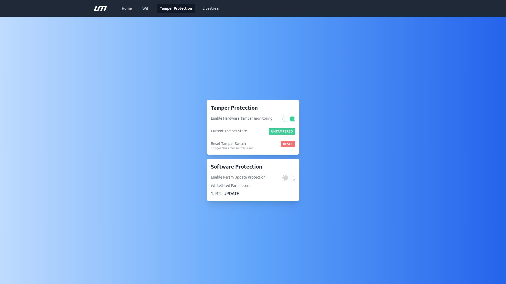

# Hardware

- Ensure that the [tamper proof module is connected to NextCC](/next-cc/getting-started/hardware-setup.md)
- Your tamper proof module must have a switch soldered to the correct pins [S1 & S2]
- Refer the [software setup](/next-cc/getting-started/software-setup.md) to open the NextOS Dashboard

*Ensure that you RESTART the NextCC if you enable/disable any feature.*

## Enable Hardware Tamper monitoring

- Click on 'Enable Hardware Tamper monitoring'

## Tamper State

### Tampered

### Untampered

### Reset

*Note: Trigger this after switch is set*

### Test

- Press the switch and enable the tamper monitoring option. The status must be 'untampered'
- Release the switch and check if the status changes to 'tampered'
- Click on reset
