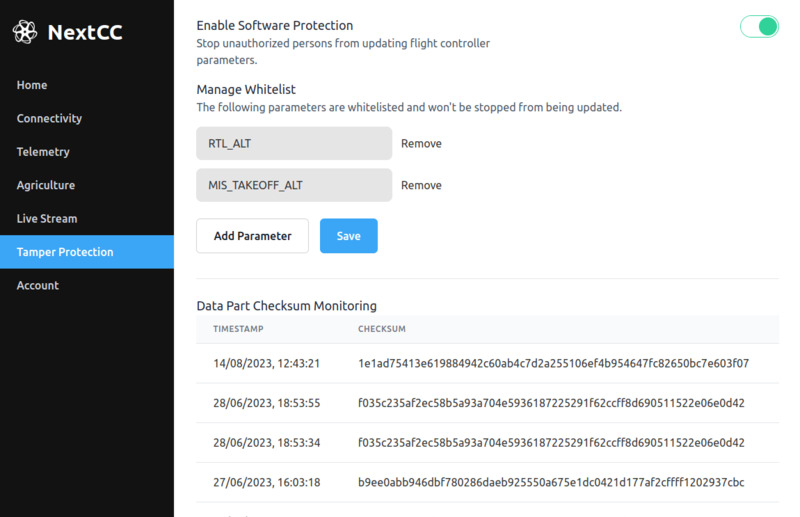

# Software

Users can leverage the software tamper protection features that include **Parameter Update Protection** and
**Data Part Checksum Monitoring** to make their drone systems software tamper proof.

To keep things development friendly, drone manufacturers can disable this feature while they are developing and testing
the drone. They can enable it when they need to give the drone to their clients.

## Parameter Update Protection

When this feature is turned on, the NextCC does not let **any GCS** update the flight controller parameters.

- Click on the `Enable Software Protection` switch.
- Restart the NextCC.

### Whitelist

The users may need to update some parameters every time for different missions, like RTL altitude. For this, they can
specify a `Whitelist` of parameters that **can be updated** even when parameter update protection is turned on.

To add parameters to the `Whitelist`:

- Click the `Add Parameter` button.
- Entering the parameter ID.
- Click on the `Save` button.
- Restart the NextCC.

## Data Part Checksum Monitoring

The NextCC does a **power-on self-test (POST)** of your drone system every time it is powered up. It communicates with
the flight controller to calculate the **data part checksum** based on the flight-critical parameters and flight
controller configurations.

If the checksum does not match the submitted checksum, the users can decide to send a warning and stop the arming of the
drone.
