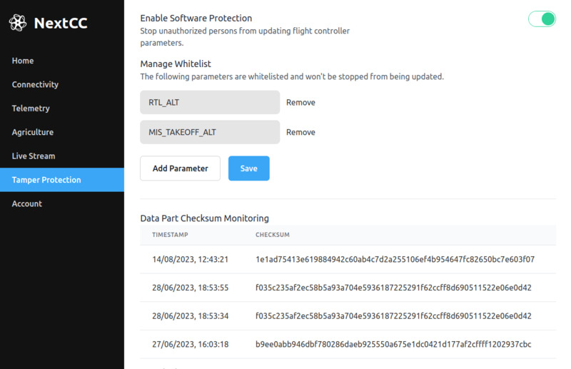

# Software

Users can leverage the software tamper protection features that include **Parameter Update Protection** and
**Data Part Checksum Monitoring** to make their drone systems software tamper proof.

## Parameter Update Protection

When this feature is turned on, the NextCC does not let **any GCS** update the parameters.

However, the users may still need to update some parameters every time before a mission, like RTL altitude. For this,
the users can specify a `Whitelist` of parameters that **can be updated** even when parameter update protection is
turned on.

- Click on the `Enable Software Protection` switch.
- Add a parameter to the `Whitelist` by clicking the `Add Parameter` button and entering the parameter ID.
- Click on the `Save` button.
- Restart the NextCC.

## Data Part Checksum Monitoring

The NextCC does a **power-on self-test (POST)** of your drone system every time it is powered up. It communicates with
the flight controller to calculate the **data part checksum** based on the flight-critical parameters and flight
controller configurations.

If the checksum does not match the submitted checksum, the users can decide to either send a warning or stop the arming
of the drone.
