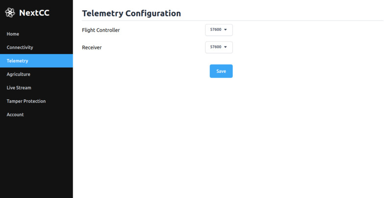

# Telemetry

Use the Telemetry page to configure the baud rates of the Flight Controller and the Telemetry Receiver ports.

The available baud rates are `57600` and `115200`.

## Changing the Baud Rate of a Port

- Select the new value from the corresponding dropdown.
- Click the `Save` button.
- Restart the NextCC.
